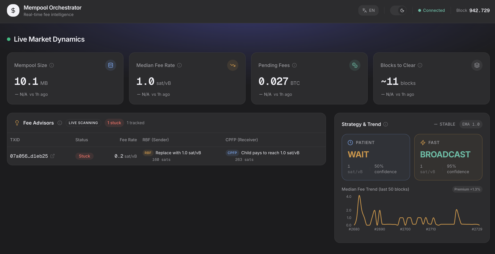
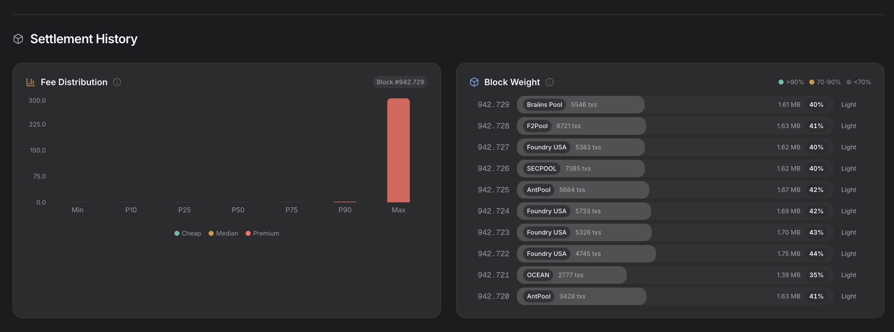
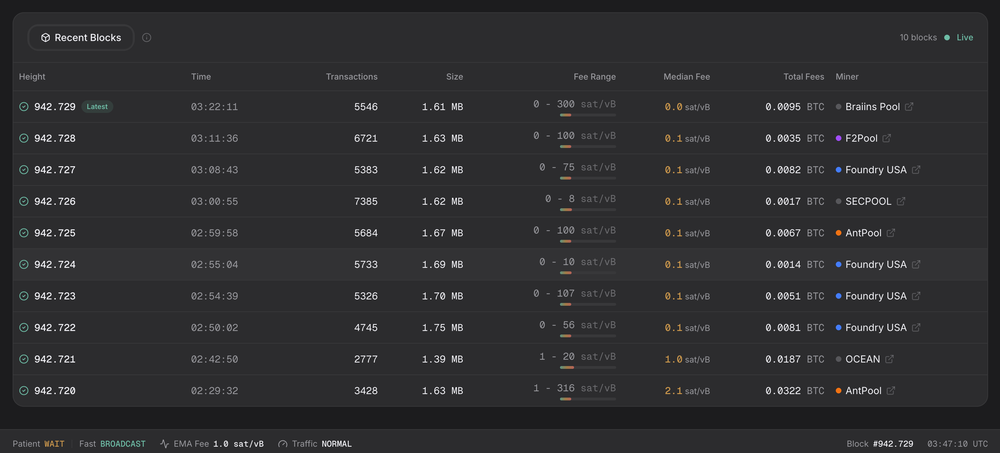

# Mempool Orchestrator

An asynchronous, event-driven orchestration engine engineered to enforce **Fee Fairness** across treasury operations. By analyzing real-time Bitcoin network consensus dynamics, it executes mathematically precise RBF (Replace-By-Fee) and CPFP (Child-Pays-For-Parent) strategies to permanently eliminate the systemic overpayment of miner fees caused by reactive bidding.

<picture>
  <source media="(prefers-color-scheme: light)" srcset="docs/images/light_live_market.png">
  
</picture>
<picture>
  <source media="(prefers-color-scheme: light)" srcset="docs/images/light_settlement_history.png">
  
</picture>
<picture>
  <source media="(prefers-color-scheme: light)" srcset="docs/images/light_recent_blocks.png">
  
</picture>

## 🛠️ Tech Stack

| Layer | Technology |
|---|---|
| **Runtime / Async** |   |
| **Event Broker** |  |
| **Materialized State** |  |
| **UI Presentation** |  |

## 🏗️ Architecture

Event-Driven Architecture (EDA) with Clean Architecture layers and **Signal & Fetch** decoupling:

```
mempool.space WS ──→ Ingestor ──→ Redpanda ──→ State Consumer ──→ PostgreSQL ──→ API ──→ Dashboard
                        │          (mempool-raw)                      ↑
                        │                                             │
                        └──→ block-signals ──→ Block Fetcher ─────────┘
                                                  ↕                   │
                                          mempool.space REST          │
                                                                      │
                           tx_hunter (60s poll) ──→ advisories ───────┘
```

| Layer | Component | Responsibility |
|---|---|---|
| **Domain** | `src/domain/schemas.py` | Pydantic V2 contracts (zero external deps) |
| **Infrastructure** | `src/infrastructure/database/` | SQLAlchemy 2.0 async engine + ORM models |
| **Infrastructure** | `src/infrastructure/messaging/` | aiokafka producer with lifecycle management |
| **Workers** | `src/workers/ingestor.py` | WebSocket → Kafka (Signal & Fetch pattern, ADR-021 fee enrichment) |
| **Workers** | `src/workers/block_fetcher.py` | block-signals → REST → Kafka (confirmed blocks) |
| **Workers** | `src/workers/state_consumer.py` | Kafka → PostgreSQL (idempotent materialization + UPSERT) |
| **Workers** | `src/workers/backfill.py` | Incremental block gap detection + auto-fill on boot |
| **Workers** | `src/workers/tx_hunter.py` | Advisory engine: polls stuck TXs, calculates RBF/CPFP fees |
| **API** | `src/api/` | Read-only FastAPI endpoints + inline market analytics |
| **Core** | `src/core/config.py` | Centralized config via `pydantic-settings` |

## 🚀 Quick Start

### Prerequisites
- **Docker** & **Docker Compose**
- **Just** (Command Runner)

### Running the Orchestration Cluster

The entire microservices architecture is encapsulated within Docker. Run the environment easily via `Just`:

```bash
# Provide local environment variables for the cluster
cp .env.example .env

# Builds and starts Redpanda, Postgres, FastAPI, Workers, and Next.js
just up

# Verify all healthchecks and container states
just status

# Tail logs surgically (e.g., just logs worker-tx-hunter)
just logs <name>
```

**Access Points:**
- **Dashboard:** `http://localhost:3000`
- **FastAPI Docs:** `http://localhost:8000/docs`
- **pgAdmin DB Viewer:** `http://localhost:5050` (see `.env` for credentials)

### Shutting Down & Utilities
```bash
just down             # Stops all services and clears the network
just test             # Run backend test suite
just check            # System health check (Python env + Docker)
just sync             # Sync backend dependencies
just --list           # Show all available recipes
```

## 📂 Project Structure
```text
├── backend/
│   ├── src/
│   │   ├── api/              # FastAPI endpoints + queries
│   │   ├── core/             # Configuration (pydantic-settings)
│   │   ├── domain/           # Pydantic V2 schemas (pure contracts)
│   │   ├── infrastructure/
│   │   │   ├── database/     # SQLAlchemy async engine + ORM models
│   │   │   └── messaging/    # aiokafka producer
│   │   └── workers/          # Async workers (ingestor, block_fetcher, state_consumer, backfill, tx_hunter)
│   ├── scripts/              # Maintenance (legacy backfill, migrations)
│   └── tests/
├── frontend/                 # Next.js + shadcn/ui dashboard (EN/ES)
├── infra/                    # Docker Compose (Redpanda, PostgreSQL, pgAdmin)
└── docs/                     # ADRs, architecture, roadmap
```

## 📊 Data Models (PostgreSQL)

**`blocks` table** (confirmed blocks)
| Column | Type | Description |
|---|---|---|
| `height` | INTEGER (PK) | Block height |
| `hash` | VARCHAR(64) | Block hash |
| `timestamp` | BIGINT | Unix timestamp |
| `tx_count` | INTEGER | Transaction count |
| `size` | INTEGER | Block size (bytes) |
| `median_fee` | FLOAT | Median fee rate (sat/vB) |
| `total_fees` | BIGINT | Total fees (satoshis) |
| `pool_name` | VARCHAR(64) | Mining pool name |
| `fee_range` | JSONB | Fee rate distribution array |

**`mempool_snapshots` table** (point-in-time mempool state)
| Column | Type | Description |
|---|---|---|
| `id` | INTEGER (PK) | Auto-increment |
| `captured_at` | TIMESTAMPTZ | Server timestamp |
| `tx_count` | INTEGER | Mempool transaction count |
| `total_bytes` | BIGINT | Total mempool size |
| `total_fee_sats` | BIGINT | Total fees (satoshis) |
| `median_fee` | FLOAT | Fee floor proxy |

**`mempool_block_projections` table** (projected blocks — UNLOGGED, UPSERT + orphan cleanup)
| Column | Type | Description |
|---|---|---|
| `block_index` | INTEGER (PK) | 0 = next block |
| `captured_at` | TIMESTAMPTZ | Server timestamp |
| `block_size` | INTEGER | Projected block size (bytes) |
| `block_v_size` | FLOAT | Virtual size |
| `n_tx` | INTEGER | Transaction count |
| `total_fees` | BIGINT | Total fees (satoshis) |
| `median_fee` | FLOAT | Median fee rate (sat/vB) |
| `fee_range` | JSONB | Fee rate distribution array |

**`advisories` table** (RBF/CPFP fee recommendations)
| Column | Type | Description |
|---|---|---|
| `id` | INTEGER (PK) | Auto-increment |
| `txid` | VARCHAR(64) | Transaction ID (indexed) |
| `created_at` | TIMESTAMPTZ | Server timestamp |
| `action` | VARCHAR(16) | Advisory action (e.g., BUMP) |
| `current_fee_rate` | FLOAT | Current tx fee rate (sat/vB) |
| `target_fee_rate` | FLOAT | Target fee rate for confirmation |
| `rbf_fee_sats` | BIGINT | RBF replacement cost (satoshis) |
| `cpfp_fee_sats` | BIGINT | CPFP child tx cost (satoshis) |

> **Convention:** All monetary values stored as integers in **Satoshis** to prevent floating-point precision errors.

## 🔌 API Endpoints

| Method | Path | Description |
|---|---|---|
| `GET` | `/api/mempool/stats` | Mempool KPIs: size, fees, blocks_to_clear (True Backlog), 1h deltas |
| `GET` | `/api/blocks/recent` | Confirmed blocks with pool_name and fee_range |
| `GET` | `/api/orchestrator/status` | Market analytics: EMA, trend, real-time confidence (dynamic) |
| `GET` | `/api/watchlist` | Tracked transactions with RBF/CPFP advisories |

## 🧪 Testing

```bash
just test    # 87 tests
```

**Test Coverage:**
- `tests/test_config.py`: Environment variable validation (12 tests)
- `tests/test_schemas.py`: Pydantic V2 contract validation (13 tests)
- `tests/test_ingestor.py`: WebSocket routing + ADR-021 enrichment (11 tests)
- `tests/test_kafka_producer.py`: Async producer wrapper (7 tests)
- `tests/test_block_fetcher.py`: Block signal processing + REST fetch (5 tests)
- `tests/test_state_consumer.py`: ORM models + UPSERT pattern (12 tests)
- `tests/test_backfill.py`: Incremental gap detection (6 tests)
- `tests/test_queries.py`: Confidence calculation + premium guard (10 tests)
- `tests/test_tx_hunter.py`: RBF/CPFP calculations + classification (11 tests)

## 📖 Documentation

- [Architecture Guide](docs/architecture.md) - System design and component breakdown
- [Data Dictionary](docs/data_dictionary.md) - Metric definitions, calculations, and data lineage
- [Decision Log](docs/decisions.md) - Architectural decisions and project journal
- [Strategy Roadmap](docs/strategy.md) - Product vision and phased roadmap

## ⚙️ Development Workflow

```bash
just --list  # Show all available commands
```

**Lead Engineer:** Israel (@ieshatchuell)