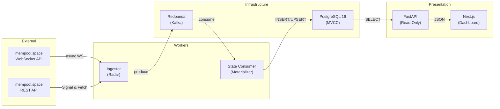
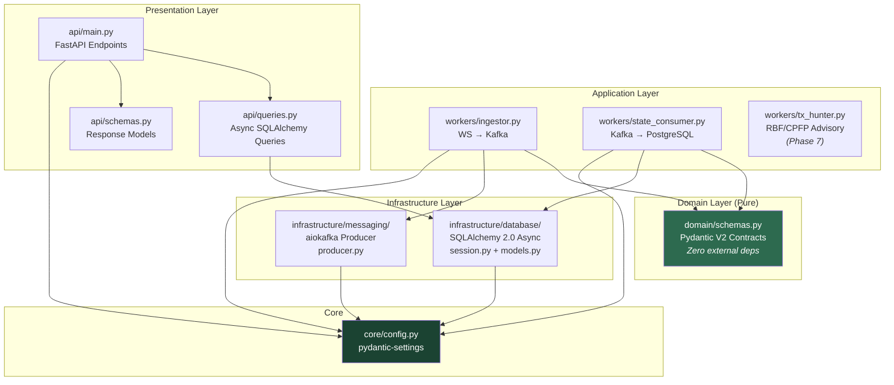
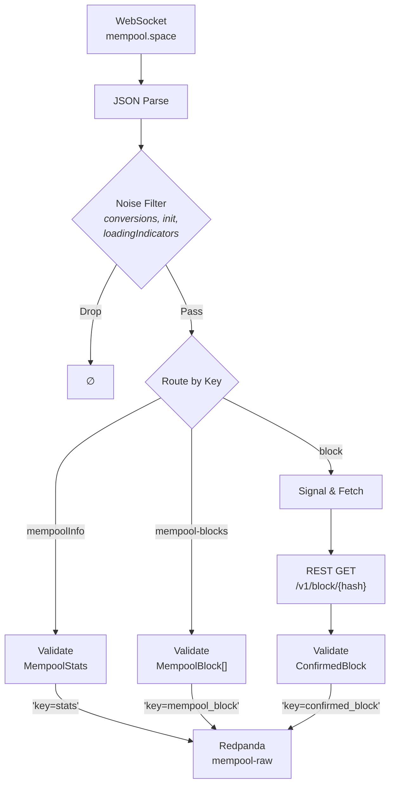
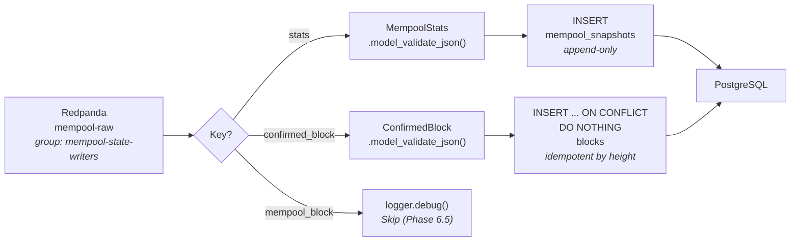
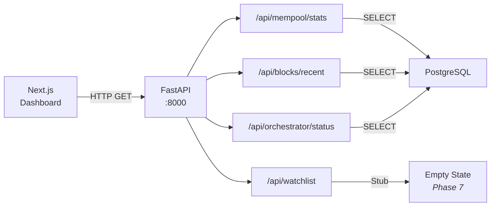
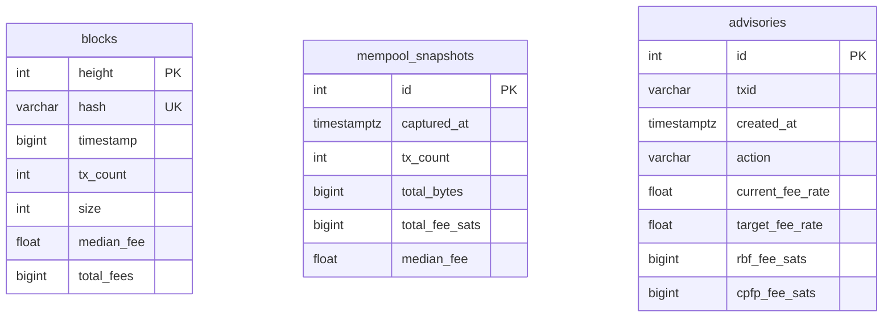
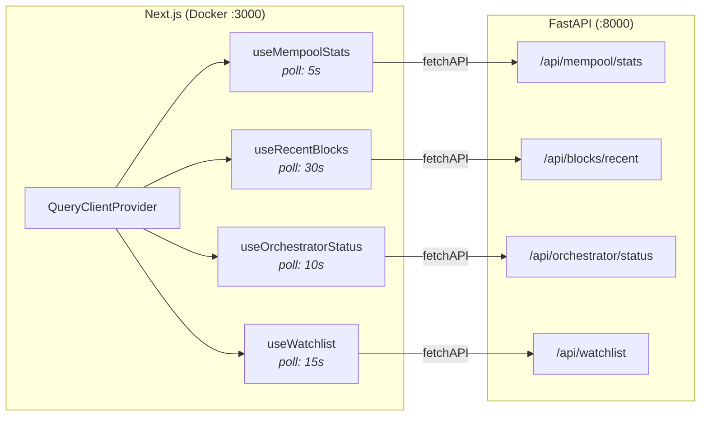
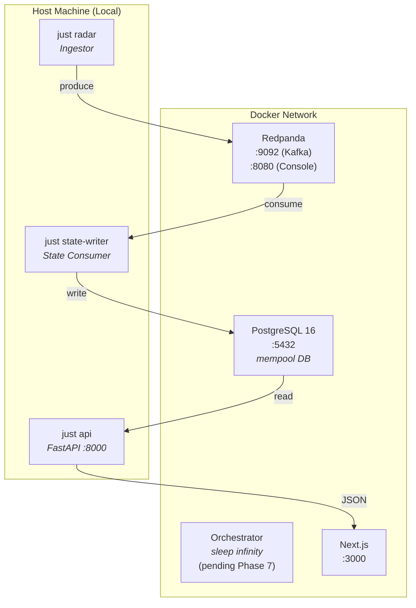

# System Architecture

## 1. High-Level Overview

The system implements an **Event-Driven Architecture (EDA)** with **Clean Architecture** layers. Data flows from the Bitcoin network through Kafka to PostgreSQL, and is served to the dashboard via a read-only FastAPI API.



## 2. Clean Architecture Layers

The codebase follows strict dependency rules — inner layers never import from outer layers.



## 3. Data Flow (Detailed)

### 3.1 Ingestion Pipeline (The "Radar")

The Ingestor connects to the mempool.space WebSocket API and routes validated events to Kafka by key:



### 3.2 State Consumer (Kafka → PostgreSQL)

The State Consumer materializes Kafka events into PostgreSQL tables based on message key:



### 3.3 API Layer (Read-Only Presentation)



## 4. Component Breakdown

### A. Domain Layer — `src/domain/schemas.py`

Pure Pydantic V2 contracts. Zero imports from databases, Kafka, or frameworks.

| Schema | Purpose | Key Fields |
|---|---|---|
| `MempoolStats` | Mempool state from WS | `mempool_info.size`, `.bytes`, `.total_fee` |
| `MempoolBlock` | Projected block template | `block_size`, `median_fee`, `fee_range` |
| `ConfirmedBlock` | Mined block (Signal & Fetch) | `height`, `id`, `tx_count`, `extras.median_fee` |
| `FeeAdvisory` | RBF/CPFP recommendation | `txid`, `action`, `rbf_fee_sats`, `cpfp_fee_sats` |

**Conventions:**
- All monetary values stored as `int` (Satoshis) — never `float`
- `ConfigDict(strict=True)` enforced on all models
- `alias_generator=to_camel` for automatic API field mapping

### B. Infrastructure — Database (`src/infrastructure/database/`)

| File | Purpose |
|---|---|
| `session.py` | Async SQLAlchemy engine (`asyncpg`, pool_size=5, max_overflow=10) |
| `models.py` | ORM models: `BlockRecord`, `MempoolSnapshot`, `AdvisoryRecord` |

**PostgreSQL Tables:**



### C. Infrastructure — Messaging (`src/infrastructure/messaging/`)

| File | Purpose |
|---|---|
| `producer.py` | `MempoolProducer` — async aiokafka wrapper with `start()`, `send()`, `stop()` lifecycle |

### D. Workers (`src/workers/`)

| Worker | Role | Input → Output |
|---|---|---|
| `ingestor.py` | Radar | WebSocket → Kafka |
| `state_consumer.py` | Materializer | Kafka → PostgreSQL |
| `tx_hunter.py` | Advisory Engine | Kafka → advisories table *(Phase 7)* |

### E. API Layer (`src/api/`)

| File | Purpose |
|---|---|
| `main.py` | FastAPI app, lifespan (DDL bootstrap + dispose), CORS, endpoints |
| `queries.py` | Async SQLAlchemy query functions (read-only) |
| `schemas.py` | Response Pydantic models |

### F. Core (`src/core/`)

| File | Purpose |
|---|---|
| `config.py` | `pydantic-settings` singleton. All env vars centralized. |

**Configuration Fields:**
- `kafka_bootstrap_servers` — Redpanda connection
- `mempool_topic` — Kafka topic name
- `mempool_ws_url` — WebSocket endpoint
- `mempool_api_url` — REST API base URL
- `postgres_dsn` — SQLAlchemy async connection string

### G. Frontend Data Layer (TanStack Query v5)



## 5. Infrastructure (Docker Compose)



## 6. Project Structure

```
backend/
├── src/
│   ├── api/                    # Presentation Layer (FastAPI)
│   │   ├── main.py             # App, lifespan, endpoints
│   │   ├── queries.py          # Async SQLAlchemy queries
│   │   └── schemas.py          # Response models
│   ├── core/                   # Configuration
│   │   └── config.py           # pydantic-settings singleton
│   ├── domain/                 # Domain Layer (Pure)
│   │   └── schemas.py          # Pydantic V2 contracts
│   ├── infrastructure/         # Infrastructure Layer
│   │   ├── database/
│   │   │   ├── session.py      # Async engine + session factory
│   │   │   └── models.py       # ORM models (BlockRecord, etc.)
│   │   └── messaging/
│   │       └── producer.py     # aiokafka async producer
│   └── workers/                # Application Layer
│       ├── ingestor.py         # WS → Kafka (Radar)
│       ├── state_consumer.py   # Kafka → PostgreSQL
│       └── tx_hunter.py        # RBF/CPFP (Phase 7)
├── scripts/
│   └── backfill_blocks.py      # Maintenance: 144-block initial load
└── tests/
    ├── test_config.py          # 12 tests
    ├── test_schemas.py         # Contract validation
    ├── test_ingestor.py        # Routing logic
    ├── test_kafka_producer.py  # Producer wrapper
    └── test_api.py             # REST client
```

## 7. Architectural Patterns

### Event-Driven Architecture (EDA)
- **Event Broker:** Redpanda (Kafka-compatible, ARM64-native)
- **Topic:** `mempool-raw` — single topic, key-based routing (`stats`, `mempool_block`, `confirmed_block`)
- **Consumer Group:** `mempool-state-writers` — single consumer materializing to PostgreSQL

### Signal & Fetch
- **Signal (WebSocket):** Low-latency stream for mempool state changes
- **Fetch (REST API):** On-demand retrieval for confirmed block data (avoids 1MB Kafka message limit)

### Clean Architecture
- **Dependency Rule:** Domain → ∅ | Infrastructure → Domain + Core | Workers → All | API → Infrastructure + Domain
- **Testability:** Each layer is independently testable with mocked dependencies

### Idempotent Writes
- `BlockRecord`: `INSERT ... ON CONFLICT (height) DO NOTHING`
- `MempoolSnapshot`: Append-only (auto-increment PK)
- Safe for Kafka consumer replay and backfill re-runs

### Data Validation at Boundary
- All external data validated with Pydantic V2 `strict=True` at ingestion
- Invalid payloads logged and dropped — never corrupt downstream storage
- Monetary values: integer-only (Satoshis) to prevent IEEE 754 precision errors