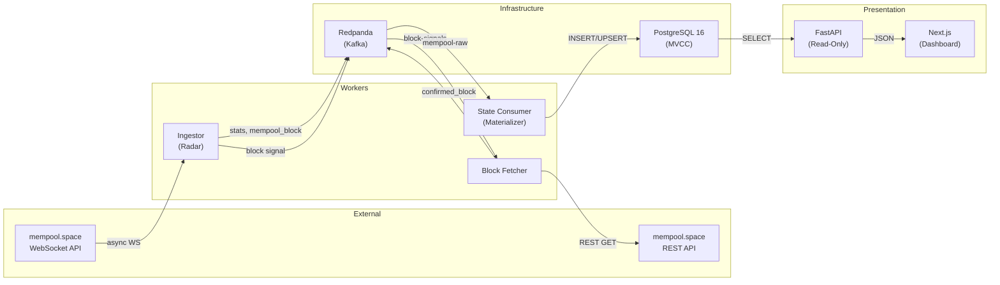
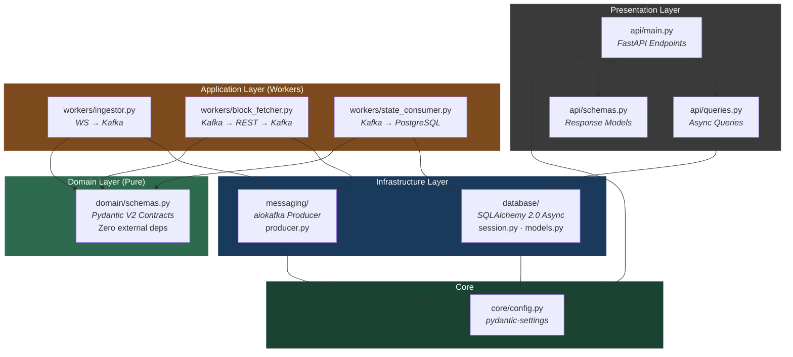
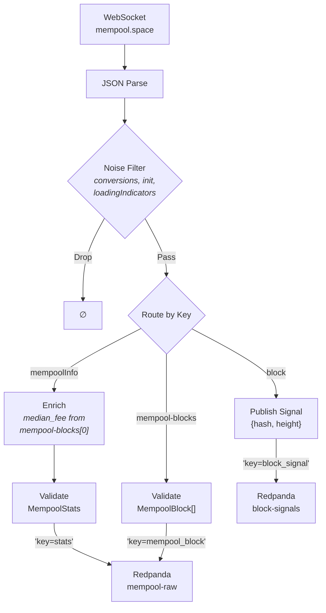
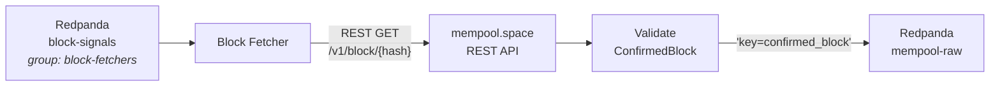
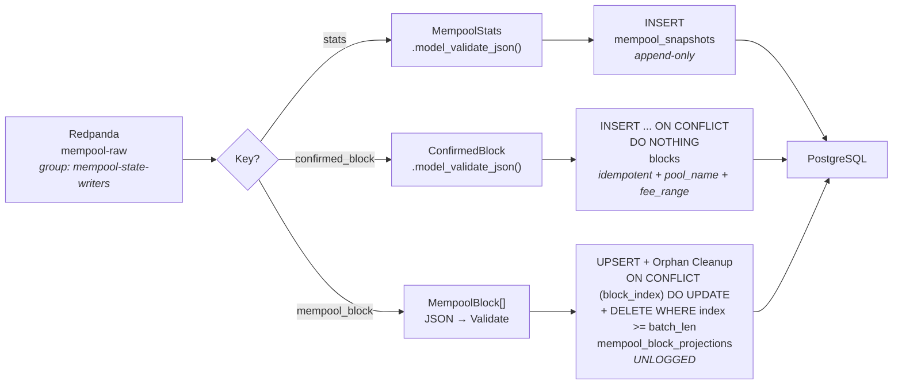
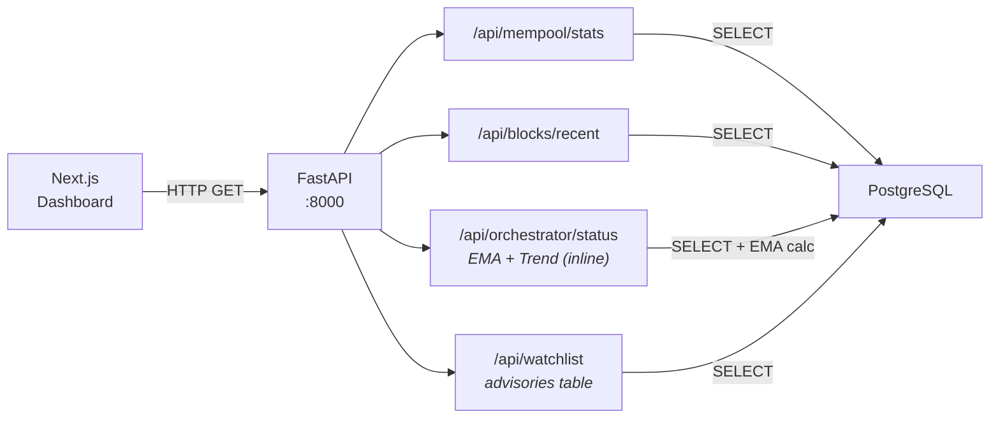
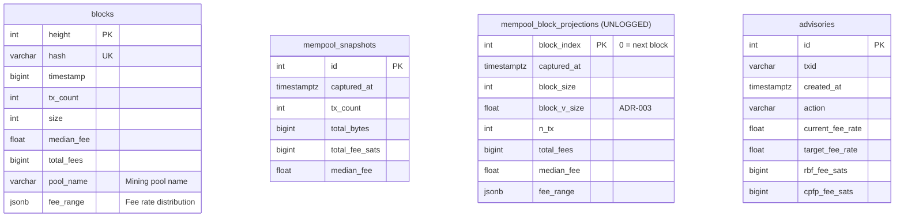
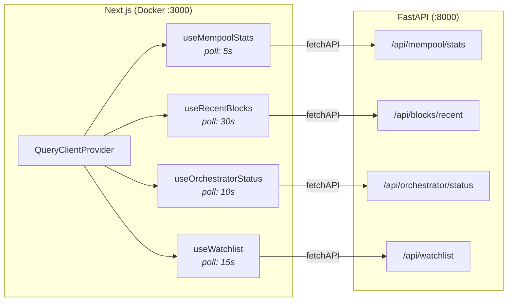
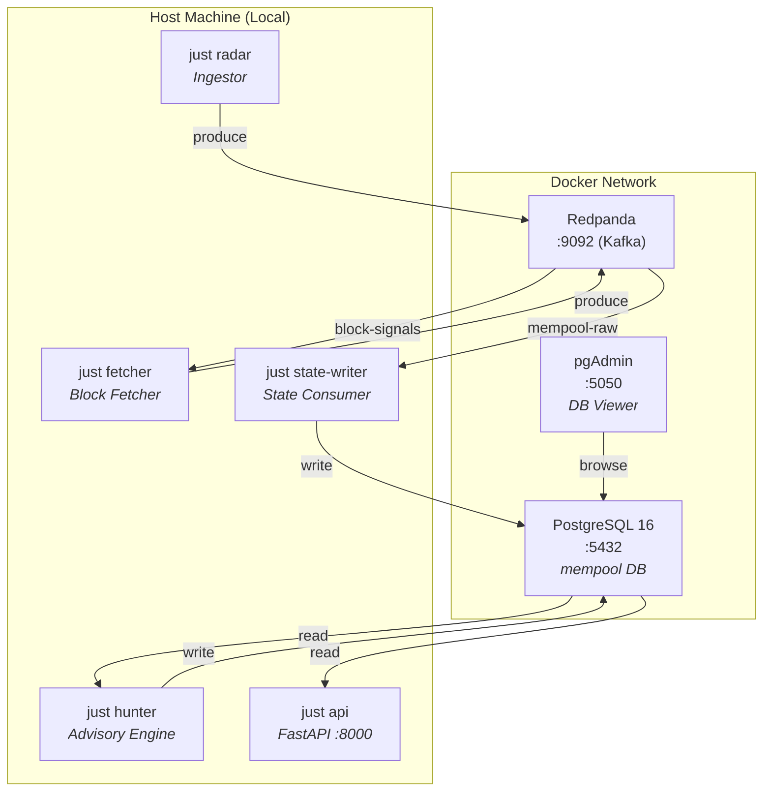

# System Architecture

## 1. High-Level Overview

The system implements an **Event-Driven Architecture (EDA)** with **Clean Architecture** layers. Data flows from the Bitcoin network through Kafka to PostgreSQL, and is served to the dashboard via a read-only FastAPI API.

Two Kafka topics decouple the pipeline:
- **`mempool-raw`** — stats, projected blocks, and confirmed blocks (key-based routing).
- **`block-signals`** — lightweight block signals (hash + height) consumed by the Block Fetcher.



## 2. Clean Architecture Layers

The codebase follows strict dependency rules — inner layers never import from outer layers. All arrows flow **downward**: outer layers depend on inner layers, never the reverse.



## 3. Data Flow (Detailed)

### 3.1 Ingestion Pipeline (The "Radar")

The Ingestor connects to the mempool.space WebSocket API and routes validated events to Kafka by key. For confirmed blocks, it publishes a lightweight signal to the `block-signals` topic — the actual REST fetch is handled by the separate Block Fetcher worker (Signal & Fetch decoupling).



### 3.2 Block Fetcher (Signal → REST → Kafka)

The Block Fetcher consumes lightweight signals from `block-signals`, fetches the full block data from the mempool.space REST API, validates it, and produces the enriched payload to `mempool-raw` for downstream materialization.



### 3.3 State Consumer (Kafka → PostgreSQL)

The State Consumer materializes Kafka events into PostgreSQL tables based on message key:



### 3.4 API Layer (Read-Only Presentation + Inline Analytics)



## 4. Component Breakdown

### A. Domain Layer — `src/domain/schemas.py`

Pure Pydantic V2 contracts. Zero imports from databases, Kafka, or frameworks.

| Schema | Purpose | Key Fields |
|---|---|---|
| `MempoolStats` | Mempool state from WS | `mempool_info.size`, `.bytes`, `.total_fee`, `.median_fee` |
| `MempoolBlock` | Projected block template | `block_size`, `median_fee`, `fee_range` |
| `ConfirmedBlock` | Mined block (Signal & Fetch) | `height`, `id`, `tx_count`, `extras.median_fee`, `extras.pool`, `extras.fee_range` |

**Conventions:**
- All monetary values stored as `int` (Satoshis) — never `float`
- `ConfigDict(strict=True)` enforced on all models
- `alias_generator=to_camel` for automatic API field mapping

### B. Infrastructure — Database (`src/infrastructure/database/`)

| File | Purpose |
|---|---|
| `session.py` | Async SQLAlchemy engine (`asyncpg`, pool_size=5, max_overflow=10) |
| `models.py` | ORM models: `BlockRecord`, `MempoolSnapshot`, `MempoolBlockProjection`, `AdvisoryRecord` |

**PostgreSQL Tables:**



> **Note:** `mempool_block_projections` is an **UNLOGGED** table — no WAL overhead for ephemeral projections that are replaced every ~10 seconds. Primary key is `block_index` enabling the UPSERT pattern.

### C. Infrastructure — Messaging (`src/infrastructure/messaging/`)

| File | Purpose |
|---|---|
| `producer.py` | `MempoolProducer` — async aiokafka wrapper with `start()`, `send()`, `stop()` lifecycle |

### D. Workers (`src/workers/`)

| Worker | Role | Input → Output | Justfile Recipe |
|---|---|---|---|
| `ingestor.py` | Radar | WebSocket → Kafka (`mempool-raw` + `block-signals`) | `just radar` |
| `block_fetcher.py` | Fetcher | `block-signals` → REST → Kafka (`confirmed_block`) | `just fetcher` |
| `state_consumer.py` | Materializer | Kafka → PostgreSQL (stats, blocks, projections) | `just state-writer` |
| `tx_hunter.py` | Advisory Engine | REST API → `advisories` table (60s poll) | `just hunter` |
| `backfill.py` | Backfiller | REST API → `blocks` table (incremental gap fill) | `just backfill` |

### E. API Layer (`src/api/`)

| File | Purpose |
|---|---|
| `main.py` | FastAPI app, lifespan (DDL bootstrap + dispose), CORS, endpoints |
| `queries.py` | Async SQLAlchemy query functions (read-only) + inline analytics (EMA, trend, strategy) |
| `schemas.py` | Response Pydantic models |

### F. Core (`src/core/`)

| File | Purpose |
|---|---|
| `config.py` | `pydantic-settings` singleton. All env vars centralized. Defines topics: `mempool_topic`, `block_signals_topic`. |

### G. Frontend Data Layer (TanStack Query v5)



## 5. Infrastructure (Docker Compose)



## 6. Project Structure

```
backend/
├── src/
│   ├── api/                    # Presentation Layer (FastAPI)
│   │   ├── main.py             # App, lifespan, endpoints
│   │   ├── queries.py          # Async SQLAlchemy queries + inline analytics
│   │   └── schemas.py          # Response models
│   ├── core/                   # Configuration
│   │   └── config.py           # pydantic-settings singleton
│   ├── domain/                 # Domain Layer (Pure)
│   │   └── schemas.py          # Pydantic V2 contracts
│   ├── infrastructure/         # Infrastructure Layer
│   │   ├── database/
│   │   │   ├── session.py      # Async engine + session factory
│   │   │   └── models.py       # ORM models (4 tables)
│   │   └── messaging/
│   │       └── producer.py     # aiokafka async producer
│   └── workers/                # Application Layer
│       ├── ingestor.py         # WS → Kafka (Radar)
│       ├── block_fetcher.py    # block-signals → REST → Kafka (Fetcher)
│       ├── state_consumer.py   # Kafka → PostgreSQL (Materializer)
│       ├── tx_hunter.py        # RBF/CPFP Advisory Engine (60s poll)
│       └── backfill.py         # Incremental block gap fill
├── scripts/
│   ├── backfill_blocks.py      # Legacy: 144-block destructive backfill
│   └── 01_add_pool_and_projections.sql  # Manual migration
└── tests/
    ├── test_config.py          # 12 tests
    ├── test_schemas.py         # Contract validation
    ├── test_ingestor.py        # Routing logic + enrichment
    ├── test_kafka_producer.py  # Async producer wrapper
    └── test_state_consumer.py  # ORM models + UPSERT pattern
```

## 7. Architectural Patterns

### Event-Driven Architecture (EDA)
- **Event Broker:** Redpanda (Kafka-compatible, ARM64-native)
- **Topics:**
  - `mempool-raw` — key-based routing (`stats`, `mempool_block`, `confirmed_block`)
  - `block-signals` — lightweight block signal (`{hash, height}`)
- **Consumer Groups:**
  - `mempool-state-writers` — State Consumer materializing to PostgreSQL
  - `block-fetchers` — Block Fetcher consuming signals, producing enriched blocks

### Signal & Fetch (I/O Decoupled)
- **Signal (WebSocket):** Ingestor publishes `{hash, height}` to `block-signals` immediately on block event — zero I/O latency
- **Fetch (REST API):** Block Fetcher consumes signal, performs `GET /v1/block/{hash}`, validates, and produces `confirmed_block` to `mempool-raw`
- **Rationale:** Decouples the latency-sensitive WebSocket consumer from the variable-latency REST fetch, preventing I/O stalls on the ingestion hot path

### Clean Architecture
- **Dependency Rule:** Domain → ∅ | Infrastructure → Domain + Core | Workers → All | API → Infrastructure + Domain
- **Testability:** Each layer is independently testable with mocked dependencies

### Idempotent Writes
- `BlockRecord`: `INSERT ... ON CONFLICT (height) DO NOTHING`
- `MempoolSnapshot`: Append-only (auto-increment PK)
- `MempoolBlockProjection`: UPSERT (`ON CONFLICT (block_index) DO UPDATE`) + orphan cleanup (`DELETE WHERE block_index >= batch_len`). **UNLOGGED** table — no WAL overhead for ephemeral projections.
- `AdvisoryRecord`: Rotating showcase pattern (DELETE all + INSERT per cycle)
- Safe for Kafka consumer replay and backfill re-runs

### Data Validation at Boundary
- All external data validated with Pydantic V2 `strict=True` at ingestion
- Invalid payloads logged and dropped — never corrupt downstream storage
- Monetary values: integer-only (Satoshis) to prevent IEEE 754 precision errors
- Median fee enrichment: injected from `mempool-blocks[0]` before validation (ADR-021)

## 8. Data Governance

> For a detailed breakdown of metric calculations, units, and data lineage, refer to the [Data Dictionary](./data_dictionary.md).