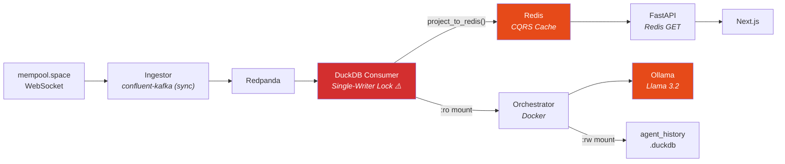
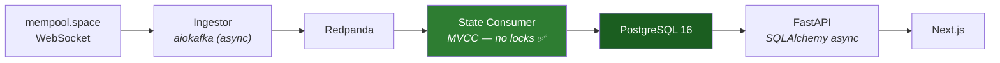

# Project Journal: Mempool Orchestrator

## Phase 1: Infrastructure Foundation (Q1 2026)

### 2026-01-18 | E2E Ingestion Pipeline & Infrastructure Hardening
**Status:** COMPLETED

**Objective:** Establish a high-performance, event-driven backbone to capture real-time Bitcoin mempool data and ensure architectural parity between local development and production-ready systems.

**Actions:**
1.  **Environment Setup:**
    * Provisioned a surgical development environment on **macOS M4** using **OrbStack** for container management and **uv** for Python dependency resolution.
    * Enforced **Python 3.12** across the stack to leverage `asyncio` performance gains and modern type hinting.
2.  **Infrastructure Deployment:**
    * Deployed a **Redpanda** broker via Docker Compose. Selected for its native ARM64 efficiency and JVM-free architecture, minimizing resource overhead on the M4 silicon.
    * Initialized the `mempool-raw` topic with `acks=1` for balanced durability.
3.  **Application Layer - Ingestor Engine:**
    * **Core Logic:** Implemented a modular package structure under `src/`.
    * **`src/common/kafka_producer.py`**: Engineered a high-level producer wrapper using `confluent-kafka`. Optimized with non-blocking `poll(0)` calls to handle delivery reports without saturating the event loop.
    * **`src/ingestors/mempool_ws.py`**: Developed an asynchronous WebSocket client for `mempool.space`. Implemented the specific subscription protocol (`want-stats`, `track-mempool`) to stream live transaction batches.
4.  **E2E Pipeline Validation:**
    * Successfully streamed live mempool data from external WebSockets into the local Redpanda bus.
    * Verified data persistence and JSON integrity via `rpk topic consume`, confirming successful offsets and key-value delivery.

**Technical Deep Dive: Infrastructure Verification**
To audit the broker's health and ensure a stable backbone, we utilized the following baseline command:
`docker exec -it infra-redpanda-1 rpk cluster health`

**Technical Challenges & Resolutions:**
- **Module Resolution:** Addressed `ModuleNotFoundError` by transitioning from direct script execution to **Module Execution Mode** (`python -m src.ingestors.mempool_ws`). Added `__init__.py` markers to formalize the package namespace.
- **Dependency Synchronization:** Resolved a `uv.lock` version drift by executing a full `uv sync` after manual `pyproject.toml` updates, ensuring a deterministic build environment.
- **Connectivity Handling:** Identified `Connection refused` errors caused by inactive containers. Implemented a pre-runtime network probe routine (`nc -zv`) for broker availability.

---

### 2026-01-20 | Developer Experience (DX) & Workflow Standardization
**Status:** COMPLETED

**Objective:** Abstract complex execution logic into a unified command runner to ensure reproducibility, reduce cognitive load, and standardize the "Developer Loop".

**Actions:**
1.  **Task Runner Integration:**
    * Adopted **Just** as the project's standard command runner.
    * Created a `Justfile` at the project root to encapsulate infrastructure lifecycle (`infra-up`, `infra-down`) and application execution.
2.  **Execution Abstraction:**
    * Replaced verbose shell commands (e.g., `uv run python -m ...` or `docker compose ...`) with semantic recipes.
    * Implemented a `check` recipe for instant system health verification, validating Python environment versions and Docker connectivity in a single pass.
3.  **Documentation Alignment:**
    * Refactored `README.md` and `architecture.md` to establish `just` commands as the canonical entry point for the project.

**Project Snapshot (End of Day):**
```text
.
├── Justfile            # Command definitions
├── docs/               # Updated architecture & journal
├── infra/
│   └── docker-compose.yml
├── src/
│   ├── common/         # Infrastructure clients
│   └── ingestors/      # Data source connectors
├── pyproject.toml
└── README.md
```

### 2026-01-21 | Configuration Hardening & Modern Refactoring
**Status:** COMPLETED

**Objective:** Eliminate configuration hardcoding, enhance type safety, and adopt modern Python 3.12 idioms for message processing.

**Actions:**
1.  **Configuration Management:**
    * Implemented **Pydantic Settings** (`src/config.py`) for strict type validation.
    * Centralized variables in `.env` (git-ignored) for security and portability.
    * Added `@field_validator` for automated whitespace sanitization.
2.  **Code Modernization (Python 3.12):**
    * Refactored `src/ingestors/mempool_ws.py` using **Structural Pattern Matching** (`match/case`) for event routing.
    * Optimized the WebSocket handshake (`action: init` + `action: want`) to align with API v1 standards.
3.  **Repository Standards:**
    * Established **GitHub Flow** with SSH authentication.
    * Hardened `.gitignore` against accidental leaks of `.env` or `.duckdb` files.

**Outcome:**
System is now environment-agnostic, fail-fast on misconfiguration, and utilizes declarative routing logic.

### 2026-01-25 | Storage Layer & Medallion Architecture
**Status:** COMPLETED

**Objective:** Persist real-time mempool data into a local OLAP storage and implement the first analytical layer.

**Actions:**
1.  **Persistence:** Integrated **DuckDB** with a buffered consumer (`src/storage/duckdb_consumer.py`) using `batch_size=50`.
2.  **Reliability:** Implemented signal handling (`_cleanup`) to ensure clean file lock releases on exit.
3.  **Data Modeling (Bronze -> Silver):**
    * **Bronze:** Raw JSON storage in `raw_mempool`.
    * **Silver:** Created `v_mempool_stats` view.
    * **Fix:** Corrected `total_fee_btc` unit handling (detected field already in BTC) and added `avg_tx_fee_sats` for operational analysis.
4.  **Dependencies:** Added `pandas` and `numpy` via `uv add` for terminal-based data auditing.

**Outcome:**
Validated end-to-end pipeline. The system now provides structured, unit-corrected Bitcoin network metrics via SQL.

# Engineering Journal

## [2026-01-27] Architecture Pivot: From Streaming to Hybrid Signal & Fetch

### Context
Attempts to implement the "Silver Layer" (raw transactions ingestion) on branch `feat/silver-transactions` exposed fundamental infrastructure limitations.

### Blockers Identified (Root Cause Analysis)
1.  **Kafka Message Size:** Bitcoin blocks (via `track-mempool`) are ~2-4MB. Redpanda defaults to 1MB limits. Increasing this causes network instability (Head-of-Line Blocking).
2.  **Mempool Protocol Conflicts:** The WebSocket API drops the connection or ignores commands when mixing lightweight subscriptions (`want: ['stats']`) with heavyweight ones (`track-mempool`).
3.  **Data Completeness:** The public WebSocket feed filters out transaction details (missing `vin`/`vout`) to save bandwidth.

### Decisions & Architecture Pivot
* **Discard Pure Streaming for Transactions:** WebSocket is insufficient for data engineering needs on the Silver Layer.
* **Adopt "Hybrid Signal & Fetch" Pattern:**
    * **Signal (WebSocket):** Listens for `block` events and `stats`. Low bandwidth.
    * **Fetch (REST API):** Triggered by the signal. Performs a robust `GET /block/{hash}/txs`.
    * **Chunking Strategy:** The Application Layer splits the 4MB payload into micro-batches (e.g., 200 txs) before producing to Kafka, bypassing the 1MB limit without ops changes.

### Capacity Planning
* **Historical Data:** ~2.3 Billion transactions total.
* **Storage Strategy:** DuckDB native columnar storage (estimated ~350GB compressed).
* **Backfill:** We will implement a "Lookback Strategy" (fetch last N blocks on boot) instead of a full historical sync for the MVP.

---

## ADR-002: Strict Data Contracts & Infrastructure Testing
**Date:** 2026-01-29  
**Status:** ✅ IMPLEMENTED  
**Context:** Phase 2 - Data Quality & Reliability

### Problem Statement
As the system grew, relying on raw JSON and untested infrastructure components introduced risks:

1. **Type Safety:** No guarantee that fees were integers or required fields existed.
2. **Logic Fragility:** Routing logic and noise filtering in the ingestor were untested.
3. **Infra Blind Spots:** The Kafka Producer wrapper and Configuration loading had no unit tests, making refactors dangerous.

### Decision
1. **Adopt Pydantic v2 Strict Mode:** Enforce data contracts at the ingestion boundary.
2. **Implement "Radar" Ingestion:** Explicitly route and validate specific WebSocket events (`stats`, `blocks`), filtering out noise (`conversions`).
3. **Enforce Comprehensive Unit Testing:** Mandate tests for both logic (Schemas, Ingestor) and infrastructure (Producer, Config) using Mocks.

### Implementation
#### Data Contracts (`src/schemas.py`)
- Pydantic v2 models with `strict=True`
- Automatic camelCase ↔ snake_case mapping
- Monetary values enforced as `int` (Satoshis)
- Models: `MempoolStats`, `MempoolBlock`, `Transaction`

#### Radar Ingestion (`src/ingestors/mempool_ws.py`)
- Silent filter for `conversions` noise
- Event routing: `mempoolInfo` → stats, `mempool-blocks` → mempool_block
- Fail-fast validation with Pydantic

#### Testing Coverage (42 Unit Tests)
```bash
tests/test_schemas.py         # 9 tests  - Contract validation
tests/test_ingestor.py        # 9 tests  - Routing logic
tests/test_kafka_producer.py  # 12 tests - Infrastructure wrapper
tests/test_config.py          # 12 tests - Environment validation
```

**Test Strategy:**
- Mocked infrastructure (no Docker required)
- Isolated unit tests for each component
- Happy path + error handling coverage

### Consequences

**Positive:**
1. **Confidence:** 42+ unit tests ensure core components work in isolation without needing Docker.
2. **Data Integrity:** Invalid data is rejected before hitting Kafka.
3. **Maintainability:** Snake_case conversion is handled automatically by the Schema layer.

**Trade-offs:**
1. **Dev Time:** Writing tests and mocks requires upfront investment (paid off by stability).
2. **Strictness:** API changes (e.g., new fields) require explicit schema updates.

**Test Results:**
```
======================== 42 passed in 0.12s =========================
```

### Next Steps
1. ✅ Schema validation for stats and mempool-blocks
2. ✅ Infrastructure testing (Config, Producer)
3. ✅ Refactor DuckDB consumer to use Pydantic schemas
4. ⏳ REST API integration for full transaction fetch

---

### 2026-02-01 | Storage Layer Refactor (The Vault)
**Status:** COMPLETED

**Objective:** Transition from raw JSON storage to a strongly-typed, analytical schema in DuckDB to enable immediate SQL analysis.

**Actions:**

1. **Refactor:** Updated `src/storage/duckdb_consumer.py` to utilize `src/schemas.py` for data parsing.

2. **Schema Evolution:** Replaced `raw_mempool` with two structured tables:
   - `mempool_stats`: Stores network pulse (fees in Satoshis).
   - `projected_blocks`: Stores candidate block templates.

3. **Semantic Fix:** Corrected the mapping of `min_fee` (previously misidentified as median) and enforced `UBIGINT` for all monetary values.

**Outcome:** The pipeline now ingests, validates, and stores typed data End-to-End. Data is query-ready immediately upon insertion.
---

## Phase 2: Infrastructure Maturity & Observability (Q1 2026)

### 2026-02-01 | REST API Client & Analytics Dashboard
**Status:** COMPLETED

**Objective:** Implement a hybrid ingestion strategy (Signal + Fetch) and add real-time observability through an analytics dashboard.

**Actions:**

1. **REST API Client Implementation:**
   - Created `src/ingestors/mempool_api.py` with async `httpx.AsyncClient`.
   - Implemented `get_block_stats(block_hash: str)` for on-demand block data fetching.
   - Added custom `MempoolAPIError` exception for comprehensive error handling (HTTP 4xx/5xx, network errors, JSON parsing).
   - Configuration: Base URL managed via `settings.mempool_api_url` (strict, no hardcoding).
   - Testing: 13 new tests using `respx` mocking (success, failure, network errors, integration scenarios).

2. **Analytics Dashboard:**
   - Created `dashboard.py` using Streamlit framework.
   - Read-only DuckDB connection for real-time data visualization.
   - Added `just dashboard` command to Justfile for one-command launch.
   - Features: Mempool statistics, projected blocks, historical trends, data quality monitoring.

3. **Architecture Evolution:**
   - Migrated to **Hybrid Signal & Fetch** pattern:
     - **Signal (WebSocket):** Low-latency mempool state changes (Radar).
     - **Fetch (REST API):** On-demand confirmed block data (Fetcher).
   - Rationale: Avoids Kafka message size limits (1MB) and ensures data completeness.

4. **Configuration Management:**
   - Added `mempool_api_url` field to `src/config.py` with default `https://mempool.space/api`.
   - All configuration fields validated with Pydantic and whitespace-stripped.

5. **Documentation Overhaul:**
   - Updated `README.md`: Removed broken links, documented typed schemas, added hybrid architecture notes.
   - Updated `docs/architecture.md`: Added sections for Fetcher (C) and Dashboard (D), upgraded data flow to V4.
   - Updated `docs/decisions.md`: Added this Phase 2 milestone entry.

**Test Results:**
```
======================== 55 passed in 0.12s =========================
Previous: 42 tests
New: 13 tests (REST API client)
```

**Outcome:** The system now supports both real-time streaming (WebSocket) and on-demand fetching (REST API) with unified observability through the dashboard. Infrastructure is production-ready for block backfill and auditing workflows.

### Next Steps
1. ✅ Schema validation for stats and mempool-blocks
2. ✅ Infrastructure testing (Config, Producer)
3. ✅ Refactor DuckDB consumer to use Pydantic schemas
4. ✅ REST API integration for block data fetching
5. ✅ Analytics dashboard for real-time observability
6. ⏳ Implement `get_block_transactions()` for full transaction ingestion
7. ⏳ Add retry logic with exponential backoff to REST client
8. ⏳ Block backfill strategy for historical data

---

## ADR-003: Schema Relaxation for Floating Point Block Sizes
**Date:** 2026-02-01  
**Status:** ✅ ACCEPTED  
**Phase:** Data Quality & Ingestion Hardening

### Context

During production deployment of the WebSocket ingestor, Pydantic validation failures were detected:

```
❌ MempoolBlock validation failed: blockVSize input should be a valid integer, got float (e.g. 997892.5)
```

**Root Cause Analysis:**
1. The `MempoolBlock` schema defined `block_v_size: int` with `strict=True` validation.
2. The Mempool.space API emits **floating-point values** for `blockVSize` (e.g., `997892.5`).
3. Pydantic v2 strict mode rejects implicit type coercion, causing all ingestion to fail.

### Decision

**Relax the schema to accept floating-point block sizes:**

1. **Schema Layer (`src/schemas.py`):**
   - Changed `MempoolBlock.block_v_size` from `int` to `float`
   - Maintains `strict=True` for all other fields
   - Preserves automatic camelCase mapping via `alias_generator`

2. **Storage Layer (`src/storage/duckdb_consumer.py`):**
   - Updated `projected_blocks` table: `block_v_size UINTEGER` → `block_v_size DOUBLE`
   - Implemented `DROP TABLE IF EXISTS` strategy for schema evolution during development

3. **Documentation:**
   - Updated README.md schema definitions to reflect `DOUBLE` type
   - Added audit query examples for data quality verification

### Consequences

**Positive:**
1. **Data Fidelity:** No data loss; captures exact API values without truncation
2. **Ingestion Stability:** Eliminates validation failures on valid WebSocket payloads
3. **Schema Flexibility:** Accommodates API precision variations without breaking changes

**Trade-offs:**
1. **Type Semantics:** Block sizes are conceptually integers (bytes), but API emits floats
2. **Storage Overhead:** `DOUBLE` (8 bytes) vs `UINTEGER` (4 bytes) per row
3. **Query Consideration:** Analysts must handle potential fractional values in aggregations

**Validation Results:**
```bash
# Production test after fix
✅ MempoolBlocks: processed 3 blocks
✅ Inserted 3 projected block records.
```

### Implementation Evidence

**Real WebSocket Payload:**
```json
{
  "mempool-blocks": [
    {
      "blockVSize": 997892.5,  ← Fractional value
      "blockSize": 1595783,
      "nTx": 3888,
      "totalFees": 2036508,
      "medianFee": 1.2053369765340756,
      "feeRange": [0.14, 0.14, 0.15, 1.20, 2.29, 3.29, 178.72]
    }
  ]
}
```

### Related Changes

- **Ingestion Logic:** Fixed premature `return` statements in `route_message()` to handle multi-key messages
- **Storage Schema:** Added `block_index` (ordering) and `fee_range` (JSON array) columns
- **Test Coverage:** Existing unit tests continue to pass; schema validation now accepts both int and float

### Next Steps
1. ✅ Monitor production ingestion for additional type mismatches
2. ⏳ Add integration test with real API payload fixtures
3. ⏳ Consider schema versioning strategy before production deployment

---

## ADR-004: Hybrid Infrastructure & Read-Only Volume Strategy
**Date:** 2026-02-02  
**Status:** ✅ IMPLEMENTED  
**Phase:** Phase 2 - The Agentic Brain (Infrastructure)

### Context

The system requires an AI Orchestrator (using Ollama + Llama 3.2) to query the DuckDB database for reasoning and analysis. However:

1. **Current Write Process:** The `storage` service runs as a local process using `uv run`, writing to `mempool_data.duckdb` with exclusive file locks.
2. **Dockerization Constraint:** Fully dockerizing the storage process would reduce dev speed and add complexity.
3. **Concurrency Risk:** Two processes (local writer + container reader) accessing the same DuckDB file can cause file lock conflicts.

### Decision

**Adopt a Hybrid Infrastructure with Read-Only Volume Mounts:**

1. **Local Processes (Speed):**
   - `ingestor` (WebSocket Radar)
   - `storage` (DuckDB Writer)
   - Benefits: Fast iteration, direct file access, no Docker overhead for hot-path data.

2. **Docker Containers (Isolation):**
   - `ollama` (Llama 3.2 model server)
   - `orchestrator` (AI Agent)
   - Benefits: GPU isolation, reproducible environment, network-isolated LLM inference.

3. **Read-Only Volume Mount Strategy:**
   ```yaml
   orchestrator:
     volumes:
       - ..:/app/data:ro  # Critical: Read-Only flag
   ```
   
   The Orchestrator connects with `read_only=True`:
   ```python
   conn = duckdb.connect(DUCKDB_PATH, read_only=True)
   ```

4. **LLM Selection:**
   - **Model:** Llama 3.2 (3B) via Ollama
   - **Rationale:** Balance of reasoning capability and inference speed on local hardware.
   - **Integration:** PydanticAI for structured tool/agent workflows.

### Consequences

**Positive:**
1. **Zero Lock Conflicts:** Read-only access guarantees no write contention with the local storage process.
2. **Dev Velocity:** Ingestion pipeline remains local, avoiding Docker rebuild cycles during iteration.
3. **Clean Separation:** AI workloads isolated in containers; data pipeline remains lightweight.
4. **Cost Efficiency:** Local LLM inference (no API costs); GPU resources dedicated to Ollama container.

**Trade-offs:**
1. **Eventual Consistency:** Orchestrator reads may lag behind live writes by the batch interval (~seconds).
2. **Path Mapping:** `DUCKDB_PATH` must be correctly mapped between host and container (`/app/data/mempool_data.duckdb`).
3. **Partial Dockerization:** Mixed runtime (local + Docker) adds operational complexity vs. full containerization.

### Implementation Details

**New Dependencies:**
```toml
"ollama>=0.5.1"       # LLM client
"pydantic-ai>=0.3.1"  # Agent framework
"loguru>=0.7.3"       # Structured logging
```

**Docker Services:**
- `ollama`: Model server on port 11434 with persistent volume for downloaded models.
- `orchestrator`: Python 3.12 + uv environment with read-only project mount.

**Justfile Recipes:**
- `just ai-up`: Start Ollama + Orchestrator
- `just ai-down`: Stop AI services
- `just ai-logs`: Tail Orchestrator logs
- `just orchestrator`: Run locally for development

### Related Files
- [Dockerfile](../Dockerfile)
- [docker-compose.yml](../infra/docker-compose.yml)
- [main.py](../src/orchestrator/main.py)

---

## ADR-005: Pivot to Neuro-Symbolic/Hybrid AI Architecture
**Date:** 2026-02-05  
**Status:** ✅ IMPLEMENTED  
**Phase:** Phase 2.5 - Safe-Guarded AI

### Context

The initial "Pure LLM Agent" approach (v1) where the AI computed decisions AND generated JSON output proved unreliable:

1. **JSON Formatting Errors:** Even with `temperature=0.0`, Llama 3.2 (3B) on CPU sometimes produced malformed JSON or deviated from the schema, causing Pydantic validation failures.
2. **Arithmetic Errors:** The LLM occasionally made calculation mistakes when computing fee premiums or thresholds.
3. **Performance:** End-to-end decision latency was ~40 seconds on CPU inference, too slow for time-sensitive treasury operations.
4. **Reliability:** No graceful degradation. If the LLM failed, the entire decision loop crashed.

### Decision

**Adopt a Neuro-Symbolic/Hybrid Architecture:**

Split the Orchestrator into two distinct layers:

1. **Layer 1: Logic (Python) - CRITICAL PATH**
   - Pure Python function `evaluate_market_rules()` computes the decision.
   - Implements deterministic business rules (thresholds, arithmetic).
   - Zero latency, 100% reliable, never fails.
   - Business rules:
     ```python
     IF fee_premium_pct > 20%:
         action = WAIT
         recommended_fee = historical_median_fee
     ELSE:
         action = BROADCAST
         recommended_fee = current_median_fee
     ```

2. **Layer 2: Narrative (LLM) - NON-CRITICAL SIDECAR**
   - Llama 3.2 generates human-readable explanations.
   - Receives the decision as INPUT (does not compute it).
   - Wrapped in timeout + try/catch with fallback text.
   - If AI fails → system continues with "Market analysis unavailable."

### Implementation

**Key Code Changes (`src/orchestrator/main.py`):**

```python
# Layer 1: Python (Critical)
def evaluate_market_rules(ctx: MempoolContext) -> MarketDecision:
    if ctx.fee_premium_pct > 20:
        return MarketDecision(action="WAIT", ...)
    else:
        return MarketDecision(action="BROADCAST", ...)

# Layer 2: LLM (Non-Critical)
async def get_ai_reasoning(agent, ctx, decision) -> str:
    try:
        result = await asyncio.wait_for(agent.run(prompt), timeout=30)
        return result.output
    except Exception:
        return FALLBACK_REASONING  # "Market analysis unavailable."
```

**Main Loop Flow:**
1. `get_market_context()` → `MempoolContext`
2. `evaluate_market_rules(ctx)` → `MarketDecision` (Python, instant)
3. `get_ai_reasoning(agent, ctx, decision)` → `str` (LLM, with fallback)
4. Combine into `AgentDecision` and log

### Consequences

**Positive:**
1. **100% Stability:** The critical path (Python) never fails. Zero JSON parse errors.
2. **~30x Faster:** Decision latency dropped from ~40s to ~1.3s.
3. **Graceful Degradation:** If Ollama is down, the system continues with fallback reasoning.
4. **Maintainable:** Business rules are explicit Python code, not buried in LLM prompts.
5. **Testable:** Decision logic can be unit tested without spinning up the LLM.

**Trade-offs:**
1. **Less "Intelligent":** The LLM cannot suggest novel strategies; it only explains fixed rules.
2. **Prompt Simplification:** The LLM prompt is now "explain this decision" instead of "analyze and decide."
3. **Two Output Types:** Python produces `MarketDecision` (dict), LLM produces `str`, merged into final `AgentDecision`.

### Performance Comparison

| Metric | Pure LLM (v1) | Neuro-Symbolic (v2) | Improvement |
|--------|--------------|---------------------|-------------|
| Decision Latency | ~40s | ~1.3s | **~30x** |
| JSON Parse Errors | Frequent | Zero | **100%** |
| Arithmetic Accuracy | ~95% | 100% | **Perfect** |
| Graceful Degradation | ❌ | ✅ | **New** |
| Cold Start | Slow (model load) | Instant | **Faster** |

### Architecture Diagram

```
┌─────────────────────────────────────────────────────────────┐
│                 NEURO-SYMBOLIC ARCHITECTURE                 │
│                                                             │
│  ┌──────────────┐    ┌──────────────────────────────────┐  │
│  │   DuckDB     │───▶│  Layer 1: Python Logic           │  │
│  │  (context)   │    │  - evaluate_market_rules()       │  │
│  └──────────────┘    │  - Deterministic, instant        │  │
│                      └───────────────┬──────────────────┘  │
│                                      │                      │
│                                      v                      │
│                      ┌──────────────────────────────────┐  │
│                      │  MarketDecision                  │  │
│                      │  {action, recommended_fee, ...}  │  │
│                      └───────────────┬──────────────────┘  │
│                                      │                      │
│                                      v                      │
│  ┌──────────────┐    ┌──────────────────────────────────┐  │
│  │   Ollama     │◀───│  Layer 2: LLM Narrative          │  │
│  │  (Llama 3.2) │    │  - get_ai_reasoning()            │  │
│  └──────────────┘    │  - Non-critical, with fallback   │  │
│                      └───────────────┬──────────────────┘  │
│                                      │                      │
│                                      v                      │
│                      ┌──────────────────────────────────┐  │
│                      │  AgentDecision (Final)           │  │
│                      │  {action, fee, confidence,       │  │
│                      │   reasoning}                     │  │
│                      └──────────────────────────────────┘  │
│                                                             │
└─────────────────────────────────────────────────────────────┘
```

### Related Files
- [main.py](../src/orchestrator/main.py)
- [schemas.py](../src/orchestrator/schemas.py)
- [tools.py](../src/orchestrator/tools.py)

---

## ADR-006: Dedicated Database for Agent History
**Date:** 2026-02-08  
**Status:** ✅ IMPLEMENTED  
**Phase:** Phase 2 - The Memory

### Context

The Orchestrator needed to persist its decisions (Action, Fee, Reasoning) for auditing and backtesting. However:

1. **Single-Writer Constraint:** DuckDB enforces single-process write locks. The local Storage process holds the lock on `mempool_data.duckdb`.
2. **Docker Isolation:** The Orchestrator runs in Docker with `mempool_data.duckdb` mounted as read-only (`:ro`).
3. **Lock Conflict:** Attempting writes from Docker caused `IOException: Could not set lock on file`.

### Decision

**Use a separate database file (`agent_history.duckdb`) for agent logs:**

1. **Market Data:** `mempool_data.duckdb` (Host writes, Docker reads)
2. **Agent Memory:** `agent_history.duckdb` (Docker writes, Host reads)

**Docker Volume Configuration:**
```yaml
volumes:
  - ..:/app/data:ro                                    # Market data
  - ../agent_history.duckdb:/app/agent_history.duckdb:rw  # Agent memory
```

**Implementation:**
- New module: `src/storage/agent_history.py`
- Config field: `agent_history_path` in `src/config.py`
- Test suite: `tests/test_agent_history.py` (9 tests)

### Consequences

**Positive:**
1. Eliminates lock contention between Host and Docker processes.
2. Simplifies Docker volume permissions (clear RO vs RW separation).
3. Enables independent auditing of agent decisions.
4. Graceful degradation: persistence failures don't crash the agent loop.

**Trade-offs:**
1. Data split across two files (use `ATTACH` for unified queries).
2. Two database files to manage for backup/migration.

### Related Files
- [agent_history.py](backend/src/storage/agent_history.py)
- [config.py](backend/src/config.py)
- [docker-compose.yml](infra/docker-compose.yml)

---

## ADR-007: Decoupled Monorepo & Strict Data Isolation
**Date:** 2026-02-09  
**Status:** ✅ IMPLEMENTED  
**Phase:** Phase 3 - Infrastructure Maturity

### Context

The project grew from a flat file structure to a complex system with multiple concerns:

1. **Flat Structure Problems:**
   - Source code (`src/`), tests (`tests/`), scripts (`debug_db.py`), and UI (`dashboard.py`) all mixed at root level.
   - `pyproject.toml` contained both backend (Kafka, DuckDB) and frontend (Streamlit) dependencies.
   - Made it difficult to scale or migrate UI to React without affecting data pipelines.

2. **Docker Permission Conflicts:**
   - Both `mempool_data.duckdb` (RO) and `agent_history.duckdb` (RW) lived in the same `data/` folder.
   - Mounting the entire folder as `:ro` broke agent history writes; mounting as `:rw` violated security principles.
   - WAL file creation required write access to the parent directory.

### Decision

**1. Adopt Decoupled Monorepo Pattern:**

Split the project into independent workspaces:
```
├── backend/       # Data Engineering (Python, Kafka, DuckDB)
├── frontend/      # UI (Streamlit, Plotly)
├── data/          # State Storage
├── infra/         # Docker & Redpanda
└── scripts/       # Utilities
```

Each workspace has its own `pyproject.toml` and `uv.lock`.

**2. Enforce Strict Data Isolation:**

Physically separate read-only and read-write data:
```
data/
├── market/        # Read-Only (mounted :ro in Docker)
│   └── mempool_data.duckdb
└── history/       # Read-Write (mounted :rw in Docker)
    └── agent_history.duckdb
```

**3. Docker Volume Strategy:**
```yaml
volumes:
  - ../data/market:/app/data/market:ro    # Input: RO
  - ../data/history:/app/data/history:rw  # Output: RW
```

### Implementation

**Files Created/Modified:**
- `frontend/pyproject.toml` (NEW): Streamlit, Plotly, Pandas dependencies
- `frontend/app/main.py`: Refactored from `dashboard.py`, uses `os.getenv()` for configuration
- `backend/pyproject.toml`: Moved from root, backend-only dependencies
- `Justfile`: Rewritten with `cd backend/` and `cd frontend/` context switching
- `infra/docker-compose.yml`: Separate RO/RW volume mounts

**Updated Paths:**
- `config.py`: `duckdb_path = "../data/market/mempool_data.duckdb"`
- `config.py`: `agent_history_path = "../data/history/agent_history.duckdb"`

### Consequences

**Positive:**
1. **Clear Separation of Concerns:** Backend and Frontend can evolve independently.
2. **Future-Proof:** Easy path to React migration without touching data pipelines.
3. **Strict Docker Security:** Read-only data cannot be accidentally modified by containers.
4. **WAL File Isolation:** Write-ahead logs for `agent_history.duckdb` contained in their own directory.
5. **Simpler Dependency Management:** No version conflicts between Streamlit and backend packages.

**Trade-offs:**
1. **Slightly More Complex Commands:** Must `cd` into workspace or use `just` recipes.
2. **Two Lock Files:** `backend/uv.lock` and `frontend/uv.lock` managed separately.
3. **Path Awareness:** Developers must understand relative paths differ between local and Docker execution.

### Verification

```bash
# Sync both workspaces
just sync

# Run backend tests
just test  # 55 passed

# Launch dashboard
just dashboard  # Streamlit UI on localhost:8501
```

### Related Files
- [Justfile](Justfile)
- [docker-compose.yml](infra/docker-compose.yml)
- [frontend/pyproject.toml](frontend/pyproject.toml)
- [backend/pyproject.toml](backend/pyproject.toml)

---

## ADR-007: Audit Hardening — Schema Fix, Test Repair, and Persistence Optimization

- **Date:** 2026-02-11
- **Status:** Accepted
- **Triggered by:** Independent project audit (Claude Opus 4.6)

### Context

A comprehensive audit of the codebase revealed four issues requiring immediate attention:

1. **9 failing API tests** in `test_api.py` after the monorepo refactor (ADR-006). Tests mocked URLs at `/api/v1/block/...` but `config.py` defines `mempool_api_url` as `https://mempool.space/api` (without `/v1`).
2. **`total_fee` defined as `float`** in `MempoolInfo` (BTC from API), with manual conversion to Satoshis deep in `duckdb_consumer.py`. This violated our own principle: *"Monetary values are strictly int (Satoshis)"*.
3. **`DROP TABLE IF EXISTS projected_blocks`** executed on every consumer restart, silently destroying historical data.
4. **Per-call DuckDB connections** in `AgentHistory.save_decision()`, opening and closing a connection for every decision (every 60s).

### Decision

**P1 — Fix API test URLs:**
- Replace all `/api/v1/` references in `test_api.py` with `/api/` to match the real mempool.space API format.
- No changes to production code.

**P2 — Convert `total_fee` to Satoshis at the schema boundary:**
- Change `MempoolInfo.total_fee` type from `float` to `int`.
- Add `@field_validator("total_fee", mode="before")` that converts BTC float to Satoshis integer using `int(round(v * 100_000_000))`.
- Remove the manual conversion in `duckdb_consumer.py`.

**P3 — Replace `DROP TABLE` with `CREATE TABLE IF NOT EXISTS`:**
- Use the same idempotent pattern already used for `mempool_stats`.

**P4 — Persistent DuckDB connection in `AgentHistory`:**
- Open a single connection in `__init__` and reuse it across all `save_decision()` calls.
- Add `close()` method for explicit cleanup on shutdown.
- Safe because `agent_history.duckdb` has a single writer (the orchestrator).

### Consequences

**Positive:**
1. **66 tests passing** (up from 55 passing + 9 failing).
2. **IEEE 754 safety:** `total_fee` conversion uses `round()` before `int()` to prevent truncation errors (e.g., `0.29999...` → `30000000` instead of `29999999`).
3. **Data preservation:** `projected_blocks` data survives consumer restarts, enabling backtesting.
4. **Reduced I/O:** One persistent connection instead of open/close per decision cycle.

**Trade-offs:**
1. **Schema migration needed:** Existing tests relying on `total_fee` as float had to be updated.
2. **Connection lifecycle awareness:** Consumers of `AgentHistory` must call `close()` on shutdown.

### Verification

```bash
cd backend && uv run pytest -v  # 66 passed, 0 failed (0.32s)
```

### Related Files
- [schemas.py](backend/src/schemas.py)
- [duckdb_consumer.py](backend/src/storage/duckdb_consumer.py)
- [agent_history.py](backend/src/storage/agent_history.py)
- [test_api.py](backend/tests/test_api.py)
- [test_schemas.py](backend/tests/test_schemas.py)
- [test_agent_history.py](backend/tests/test_agent_history.py)

---

## ADR-008: Data Quality Hardening — Zero-Fee Filter, MinRelayFee Floor, Backfill & Dashboard

- **Date:** 2026-02-12
- **Status:** Accepted
- **Triggered by:** Data Lineage Deep Dive (Session 3)

### Context

A field-by-field data lineage trace from API source to orchestrator decision revealed three data quality issues:

1. **42% of backfilled blocks had `median_fee = 0`** — miner-filled blocks (internal consolidation, pool payouts) where the miner includes their own zero-fee transactions. These distorted the historical baseline from **1.98** to **1.00 sat/vB**, inflating the fee premium from +48% to +194% and causing false WAIT decisions.

2. **`recommended_fee = round(0.14) = 0`** crashed the orchestrator when the mempool was nearly empty. The `AgentDecision` schema correctly enforces `ge=1` (Bitcoin's default `minrelaytxfee` is 1 sat/vB — transactions below this aren't relayed by most nodes), but `evaluate_market_rules()` didn't enforce this floor.

3. **Stale `.env` paths** from the pre-refactor directory structure caused the storage consumer to write to `backend/mempool_data.duckdb` instead of `data/market/mempool_data.duckdb`.

Additionally, the dashboard (`frontend/app/main.py`) used 100% hardcoded mock data and needed to be connected to real DuckDB queries.

### Decisions

**D1 — Filter zero-fee blocks from historical baseline:**
- Added `AND median_fee > 0` to the historical query in `tools.py`.
- Only affects the baseline calculation; the current fee query is NOT filtered (a zero-fee "next block" is valid market information).

**D2 — Enforce `minrelaytxfee` floor:**
- Changed `round(ctx.current_median_fee)` → `max(1, round(ctx.current_median_fee))` in both WAIT and BROADCAST branches of `evaluate_market_rules()`.
- 1 sat/vB is Bitcoin Core's default minimum relay fee. Below this, nodes reject the transaction.

**D3 — Backfill script (`scripts/backfill_history.py`):**
- Fetches last 144 confirmed blocks (~24h) from mempool.space REST API with rate-limited pagination.
- Takes a single mempool snapshot via `/api/mempool`.
- Inserts into the same `projected_blocks` and `mempool_stats` tables used by the live pipeline.

**D4 — Dashboard connected to real DuckDB data:**
- Replaced all hardcoded values in `frontend/app/main.py` with read-only DuckDB queries.
- KPIs: mempool size, median fee, pending fees (BTC), blocks to clear.
- Table: last 10 projected blocks (`block_index=0`).
- Chart: historical `median_fee` trend (filtered `> 0`).
- Added `safe_query` helpers and graceful error handling for database unavailability.

**D5 — Fixed `.env` paths:**
- Updated `DUCKDB_PATH` from `mempool_data.duckdb` → `../data/market/mempool_data.duckdb`.
- Updated `AGENT_HISTORY_PATH` from `agent_history.duckdb` → `../data/history/agent_history.duckdb`.
- `.env` is gitignored (local-only fix).

### Consequences

**Positive:**
1. Historical baseline reflects real market conditions (1.98 sat/vB, not 1.00).
2. Orchestrator no longer crashes on low-fee markets.
3. Full E2E pipeline verified: WebSocket → Kafka → DuckDB → Orchestrator → Dashboard.
4. Dashboard shows live data instead of mock values.

**Trade-offs:**
1. The `median_fee > 0` filter reduces the historical sample window when many miner blocks are present.
2. The `max(1, ...)` floor means our recommendation never drops below 1 sat/vB, even if the market technically allows it for some nodes.

### Verification

```bash
# E2E Pipeline (all services running simultaneously)
just infra-up       # Redpanda + Ollama + Orchestrator
just radar          # WebSocket → Kafka
just storage        # Kafka → DuckDB
just ai-logs        # Orchestrator decisions (BROADCAST/WAIT)
just dashboard      # Streamlit UI on localhost:8501

# Test suite
cd backend && uv run pytest -v  # 66 passed
```

### Related Files
- [tools.py](backend/src/orchestrator/tools.py) — `AND median_fee > 0`
- [main.py](backend/src/orchestrator/main.py) — `max(1, round(...))`
- [backfill_history.py](scripts/backfill_history.py) — Backfill script
- [frontend/main.py](frontend/app/main.py) — Dashboard real data
- [.env](.env) — Fixed paths (gitignored)

---

## ADR-009: Data Model Refactoring — Table Separation & Signal-Fetch Pattern

**Date:** 2026-02-13
**Status:** Accepted

### Context

Session 3 revealed four compounding technical debts:

1. **Statistical Bias:** `AND median_fee > 0` in the historical query filtered out 42% of blocks (miner self-fills), inflating the baseline from 1.00 → 1.98 sat/vB.
2. **Banker's Rounding:** Python 3's `round(2.5) = 2` could cause fee underpayment, leaving transactions unconfirmed.
3. **Table Identity Crisis:** `projected_blocks` mixed confirmed blocks (backfill, immutable) with speculative WebSocket projections (~480 rows/min).
4. **Dead Baseline:** No live ingestion of confirmed blocks meant the historical baseline froze at the 144 backfill blocks.

### Decision

**D1 — Table Separation:**
- `projected_blocks` → split into two tables:
  - `mempool_stream`: Speculative projected blocks from WebSocket `mempool-blocks`.
  - `block_history`: Confirmed mined blocks from backfill + live WebSocket `block` signals.
- `block_history` adds new columns: `height`, `block_hash`, `pool_name`.

**D2 — Signal & Fetch Pattern for Confirmed Blocks:**
- WebSocket `block` event is a signal-only (hash, height).
- On signal: async `GET /api/v1/block/{hash}` fetches full data (fees, pool, sizes).
- Validated with `ConfirmedBlock` Pydantic model → Kafka key `confirmed_block`.
- Subscription updated: `["mempool-blocks", "stats", "blocks"]`.

**D3 — Schema Alignment:**
- Single `ConfirmedBlock` model normalizes both REST API (backfill) and WebSocket (live) sources.
- Both use camelCase: `extras.medianFee`, `extras.totalFees`, `extras.feeRange`, `extras.virtualSize`.
- `ConfirmedBlockExtras` has defaults for all fields to handle partial payloads.

**D4 — Ceiling vs Rounding:**
- `round()` → `math.ceil()` in `evaluate_market_rules()`.
- `ceil(2.5) = 3` → transaction enters the block. No underpayment risk.

**D5 — Filter Removal + Read-Time Floor:**
- Removed `AND median_fee > 0` from the historical query (preserves real market data).
- Applied `max(1.0, historical_median)` as floor **after** the query, in the logic layer.
- If 42% of blocks are zero-fee, the median drops → orchestrator recommends lower fees → correct behavior.

**D6 — Directory Safety:**
- All DuckDB connections use `Path(path).resolve()` + `os.makedirs(parent, exist_ok=True)`.
- Handles `../` relative paths and missing directories gracefully.

**D7 — Consumer Discrimination:**
- Kafka message key routing (existing pattern): `stats`, `mempool_block`, `confirmed_block`.
- No new topics or schema pollution needed.

### Consequences

**Positive:**
1. Clear data lineage: speculative vs confirmed data are never mixed.
2. Historical baseline grows in real-time as blocks are mined.
3. Fee recommendations are always safe (ceiling, never floor).
4. Zero-fee blocks contribute to baseline, correctly lowering fees in empty markets.
5. Directory creation is automatic — no manual `mkdir` needed.

**Trade-offs:**
1. Breaking change: all existing DuckDB files must be deleted before running.
2. Signal & Fetch adds ~150-300ms latency per block (REST API call).
3. `mempool_stream` growth rate (~480 rows/min) requires future retention policy.

### Verification

```bash
# Delete old DBs (breaking change)
rm -f data/market/*.duckdb* data/history/*.duckdb*

# Backfill confirmed blocks
uv run python scripts/backfill_history.py

# Full E2E Pipeline
just infra-up && just radar && just storage && just ai-up
just dashboard  # localhost:8501

# Tests
cd backend && uv run pytest -v  # 66 passed
```

### Related Files
- [duckdb_consumer.py](backend/src/storage/duckdb_consumer.py) — 3-table schema + confirmed_block routing
- [mempool_ws.py](backend/src/ingestors/mempool_ws.py) — Signal & Fetch pattern
- [schemas.py](backend/src/schemas.py) — ConfirmedBlock + ConfirmedBlockExtras
- [tools.py](backend/src/orchestrator/tools.py) — block_history baseline + mempool_stream current
- [main.py](backend/src/orchestrator/main.py) — math.ceil()
- [backfill_history.py](scripts/backfill_history.py) — Writes to block_history
- [frontend/main.py](frontend/app/main.py) — Dashboard queries updated

---

## ADR-010: Scientific Backtesting — Strategy Validation

**Date:** 2026-02-14
**Status:** Accepted

### Context

Phase 2 requires validating that our fee strategy ("20% Premium") actually saves sats compared to naive alternatives. Without backtesting, the 20% threshold is an assumption, not evidence.

### Decision

Built `scripts/backtest.py` — a standalone backtesting engine that replays 4 fee strategies against `block_history` (confirmed blocks) and measures cumulative cost, slippage, and hit rate.

**Strategies tested:**

| ID | Strategy | Logic |
|---|---|---|
| S0 | Naive (Market) | Always pay `ceil(median_fee)` — zero intelligence baseline |
| S1 | SMA-20 | Simple Moving Average of last 20 blocks |
| S2 | EMA-20 | Exponential Moving Average (α=2/21) |
| S3 | Orchestrator | 20% Premium threshold, `ceil()`, `max(1, ...)` — our production logic |

**Results (146 blocks, heights 936298–936445):**

| Strategy | Σ Cost | Slippage | Hit Rate |
|---|---|---|---|
| S0 Naive (Market) | 206 sv | baseline | 98.6% |
| S1 SMA-20 | 205 sv | -0.5% | 89.7% |
| S2 EMA-20 | 196 sv | -4.9% | 93.8% |
| **S3 Orchestrator** | **149 sv** | **-27.7%** | **82.2%** |

**Market context:** Low-fee period (avg 0.91 sat/vB), 37% zero-fee blocks.

### Consequences

**Positive:**
1. Orchestrator strategy is the clear winner: **saves 27.7%** of cumulative fees vs naive.
2. Hit rate of 82% is acceptable — the 18% of "misses" are blocks where our fee wouldn't have entered, but in practice a WAIT decision means we don't broadcast at all.
3. EMA-20 is a strong runner-up (-4.9%, 94% hit rate) — could be useful as a hybrid input.

**Trade-offs:**
1. Results are from a **low-fee period**. High-volatility periods may shift rankings.
2. Hit rate favors naive (98.6%) — our strategy intentionally sacrifices inclusion for savings.
3. The backtest assumes 1 tx per block, which simplifies real-world behavior.

**Recommendation:**
- Keep the 20% Premium strategy as primary.
- Consider adding EMA as a secondary signal in Phase 3.
- Re-run backtest periodically as more blocks accumulate (especially after fee spikes).

### Verification

```bash
cd backend && uv run python ../scripts/backtest.py
```

### Related Files
- [backtest.py](scripts/backtest.py) — Backtesting engine
- [main.py](backend/src/orchestrator/main.py) — `evaluate_market_rules()` (S3 source of truth)

---

## ADR-011: Strategy Simulator — Interactive Dashboard & Reusable Module

**Date:** 2026-02-14
**Status:** Accepted

### Context

ADR-010 validated our strategy via CLI (`backtest.py`), but the results were static. We needed:
1. A reusable strategy module — `backtest.py` had inline functions that couldn't be shared with the dashboard.
2. Visual comparison — stakeholders (and the orchestrator itself, in Phase 3) need to see strategy behavior over time, not just summary numbers.

### Decision

**D1 — Extracted `backend/src/strategies.py`:**
- Pure functions: `strategy_naive()`, `strategy_sma()`, `strategy_ema()`, `strategy_orchestrator()`
- Batch compute: `compute_strategy_fees(median_fees, fee_ranges, strategy_name) → StrategyResult`
- Utility: `compute_slippage(strategy_cost, naive_cost) → float`
- No DuckDB dependency — takes plain lists, returns dataclasses. Testable and framework-agnostic.

**D2 — Refactored `scripts/backtest.py`:**
- Now a thin wrapper: loads data → calls `compute_strategy_fees()` → prints report.
- Verified identical output (206/205/196/149 sv, same hit rates).

**D3 — Dashboard Strategy Simulator:**
- Added `sys.path` bridge for frontend→backend imports.
- `st.selectbox` with 3 strategies: SMA-20, EMA-20, Orchestrator.
- Overlay chart: "The Truth" (orange, actual `median_fee`) vs strategy recommendation (green).
- 3 KPIs with delta indicators: Σ Cost, Slippage, Hit Rate.

### Consequences

**Positive:**
1. Single source of truth for strategy logic — any change to `strategies.py` updates both CLI and dashboard.
2. Dashboard is now a decision-support tool, not just a monitor.
3. Visual comparison makes it easy to spot where strategies diverge from market.

**Trade-offs:**
1. `sys.path` hack for frontend→backend imports is pragmatic but not ideal. Phase 4 (React migration) will solve this with a proper API layer.
2. Dashboard recalculates strategies on every page load (no caching). Acceptable at 146 blocks, may need `@st.cache_data` at scale.

### Related Files
- [strategies.py](backend/src/strategies.py) — Reusable strategy module
- [backtest.py](scripts/backtest.py) — CLI backtest (thin wrapper)
- [main.py](frontend/app/main.py) — Dashboard with Strategy Simulator

---

## ADR-012: Dual-Mode Strategy Engine & EMA Hybrid Signal

**Date:** 2026-02-15
**Status:** Accepted

### Context

Phase 2 backtesting (ADR-010) revealed two distinct strategies with complementary strengths:

| Strategy | Savings | Hit Rate | Best For |
|----------|---------|----------|----------|
| Orchestrator (20% Premium) | -27.7% | 82.2% | Treasury operations (patience rewarded) |
| EMA-20 | -4.9% | 93.8% | Time-sensitive operations (reliability matters) |

The orchestrator was hardcoded to a single strategy. Different operational contexts (treasury consolidation vs urgent payments) demand different risk/reward tradeoffs.

Additionally, the EMA signal was only used in backtesting (`strategies.py`), not in the live orchestrator. Its trend information (fees rising/falling) could improve confidence calibration in the existing strategy.

### Decision

**D1 — Dual-Mode Strategy Engine:**
- Added `STRATEGY_MODE` env var: `PATIENT` (default) or `RELIABLE`.
- Refactored `evaluate_market_rules()` to dispatch by mode:
  - **PATIENT:** Existing 20% premium logic + EMA confidence adjustments.
  - **RELIABLE:** Always BROADCAST with `ceil(ema_fee)`, fixed confidence 0.8.
- Mode propagated through the full pipeline: `MempoolContext` → `MarketDecision` → `AgentDecision` → `decision_history`.

**D2 — EMA Hybrid Signal (PATIENT mode):**
- Compute EMA-20 from `block_history` and classify trend (RISING/FALLING/STABLE).
- Trend adjusts PATIENT confidence as secondary intelligence:

| Trend + Action | Adjustment | Rationale |
|---|---|---|
| RISING + WAIT | +0.1 | Fees climbing → WAIT is well-justified |
| RISING + BROADCAST | -0.15 | Fees climbing → risky to broadcast now |
| FALLING + WAIT | -0.1 | Fees dropping → our caution may be excessive |
| FALLING + BROADCAST | +0.1 | Fees dropping → good time to broadcast |
| STABLE | ±0.0 | No adjustment needed |

Confidence bounded to [0.3, 1.0].

**D3 — EMA Trend Classification:**
- `_compute_ema()`: Exponential Moving Average with α = 2/(window+1).
- `_classify_ema_trend()`: Compares EMA now vs 5 blocks ago. ±5% → RISING/FALLING.

**D4 — Persistence & Auditability:**
- `decision_history` table: new `strategy_mode VARCHAR NOT NULL DEFAULT 'PATIENT'` column.
- `model_version` bumped to `neuro-symbolic-v2`.
- Breaking change: `rm data/history/*.duckdb*` required (dev-phase decision).

**D5 — Dashboard Mode Badge:**
- Header shows active mode: 🐢 PATIENT or ⚡ RELIABLE.
- Strategy Simulator continues to allow interactive comparison of all strategies regardless of active mode.

### Consequences

**Positive:**
1. Operators can choose strategy per context without code changes.
2. EMA trend makes PATIENT mode smarter — confidence reflects market momentum.
3. Full audit trail: every decision records which mode produced it.
4. Dashboard provides at-a-glance mode awareness.

**Trade-offs:**
1. Breaking change on `decision_history` (acceptable in dev phase).
2. RELIABLE mode doesn't analyze premiums — intentionally sacrifices savings for reliability.
3. EMA trend is computed from all `block_history` rows per cycle — may need optimization at scale.

### Verification

```bash
cd backend && uv run pytest -v  # 111 passed (45 new), 0 failed (0.47s)
```

**Test Coverage:**
- `test_orchestrator.py`: 20 tests (PATIENT mode, RELIABLE mode, EMA confidence)
- `test_strategies.py`: 25 tests (pure strategy functions)
- `test_agent_history.py`: Updated for 8-column schema + v2

### Related Files
- [main.py](backend/src/orchestrator/main.py) — Dual-mode `evaluate_market_rules()`
- [tools.py](backend/src/orchestrator/tools.py) — EMA computation + trend classification
- [schemas.py](backend/src/orchestrator/schemas.py) — `ema_fee`, `ema_trend`, `strategy_mode` fields
- [config.py](backend/src/config.py) — `strategy_mode` setting
- [agent_history.py](backend/src/storage/agent_history.py) — `strategy_mode` persistence
- [frontend/main.py](frontend/app/main.py) — Mode badge in dashboard

---

### ADR-013 | Watchlist Module + Dust Watch Alert
**Date:** 2026-02-15
**Status:** IMPLEMENTED
**Supersedes:** None

#### Context
Phase 3 item 3 (Watchlist) and item 4 (Dust Watch) from the strategy roadmap. The orchestrator needed the ability to track specific Bitcoin transactions by TXID and alert on low-fee consolidation windows.

**Data Source Analysis:**
The WebSocket connection only delivers aggregated data (`stats` + `mempool-blocks` events). It does NOT provide individual transaction IDs. Therefore, tracking individual TXIDs requires REST API polling.

#### Decision

**Watchlist Module:**
- **Persistence:** DuckDB table `watchlist` in the same DB as `agent_history` (avoids file lock conflicts with market data).
- **Schema:** `txid` (PK), `role` (SENDER/RECEIVER), `added_at`, `status` (PENDING/CONFIRMED), `fee`, `fee_rate`, `confirmed_at`, `block_height`.
- **Monitor:** Async REST polling via `GET /api/tx/{txid}` — checks `status.confirmed` for each PENDING tx.
- **Integration:** Runs as Step G in the orchestrator loop, after decision persistence. Non-blocking, silent failures.
- **SENDER/RECEIVER role:** Infrastructure for Session 8 RBF/CPFP advisors.

**Dust Watch:**
- Simple log alert: `💎 Dust Watch: Consolidation window!` when `ema_fee < 5 sat/vB`.
- Dashboard banner: `st.success()` when latest median fee < 5 sat/vB.
- Purely informational — no action change.

#### Consequences
- **Good:** Transaction tracking infrastructure ready for RBF/CPFP advisors (Session 8).
- **Good:** `GET /api/mempool/recent` can seed real TXIDs for integration testing.
- **Good:** Monitor handles API errors gracefully (404 for dropped txs, network errors) without breaking the decision loop.
- **Neutral:** Shared DuckDB file means `rm data/history/*.duckdb*` also clears watchlist.
- **Risk:** Public API rate limit (~10 req/min). Large watchlists could hit throttling. Mitigated by processing one tx per cycle.

#### Verification
- 19 unit tests in `test_watchlist.py` (schema, CRUD, status transitions, Pydantic validation).
- 130 total tests passing (19 new + 111 existing).
- E2E validated: DB persistence, Dust Watch detection at 1 sat/vB, graceful 404 handling for dropped tx.

#### Related Files
- [watchlist.py](backend/src/storage/watchlist.py) — DuckDB table + CRUD
- [watchlist_monitor.py](backend/src/orchestrator/watchlist_monitor.py) — Async REST polling
- [main.py](backend/src/orchestrator/main.py) — Dust Watch (Step E.2) + Watchlist check (Step G)
- [frontend/main.py](frontend/app/main.py) — Dust Watch banner
- [test_watchlist.py](backend/tests/test_watchlist.py) — 19 tests

---

### ADR-014 | RBF & CPFP Fee Advisors
**Date:** 2026-02-19
**Status:** IMPLEMENTED
**Supersedes:** None
**Completes:** Phase 3 (The Prescriptive Operator)

#### Context
Phase 3 items 5 (RBF Advisor) and 6 (CPFP Advisor) from the strategy roadmap. When a tracked transaction is stuck in the mempool, the orchestrator should calculate the optimal replacement or child fee based on the user's role:
- **SENDER** → RBF (Replace-By-Fee): Sign a new tx replacing the original with higher fee.
- **RECEIVER** → CPFP (Child-Pays-For-Parent): Create a child tx spending the unconfirmed output with enough fee to incentivize miners.

**Key Architectural Constraint:** Advisors use the `recommended_fee` from `evaluate_market_rules()`, NOT the raw mempool median. This ensures fee calculations respect the active strategy mode (PATIENT or RELIABLE).

#### Decision

**Module Refactor:**
- `src/strategies.py` → `src/strategies/__init__.py` (package). All 3 existing import sites remain valid.
- New `src/strategies/advisors.py` — pure deterministic functions, zero I/O, fully testable.

**RBF Advisor (Sender, BIP-125):**
- Stuck detection: `original_fee_rate < target_fee_rate`
- Rate rule: `new_rate = max(target_rate, original_rate + 1.0)` (MinRelayTxFee relay rule)
- Fee calculation: `target_fee_sats = ceil(new_rate * vsize)`
- **BIP-125 Rule 3 guard:** `target_fee_sats = max(target_fee_sats, original_fee_sats + 1)` — absolute fee must be strictly greater
- Floor: rate never below 1 sat/vB

**CPFP Advisor (Receiver, Package Relay):**
- Stuck detection: `parent_fee_rate < target_fee_rate`
- Package formula: `child_fee = ceil(target_rate × (parent_vsize + child_vsize)) - parent_fee`
- Floor: `child_fee ≥ ceil(MIN_RELAY_FEE_RATE × child_vsize)` — child must be independently relayable
- Package rate: `(parent_fee + child_fee) / (parent_vsize + child_vsize)`
- Constant: `ESTIMATED_CHILD_VSIZE = 141.0` (P2WPKH spend)

**Integration:**
- `watchlist_monitor.py`: `check_watchlist()` gains `target_fee_rate` parameter. For each pending tx, extracts `fee` + `weight` from API response, computes `vsize = weight/4` (BIP-141), and dispatches to `evaluate_rbf()` or `evaluate_cpfp()` based on role.
- `main.py` Step G: Passes `decision["recommended_fee"]` to the monitor — this is the fee the orchestrator computed in the current cycle.
- Dashboard: Fee Advisors panel shows alerts for stuck watchlist txs.

#### Consequences
- **Good:** Prescriptive alerts with exact fee amounts — users know how much to pay.
- **Good:** Advisors respect PATIENT/RELIABLE mode — no conflict with the strategy engine.
- **Good:** Pure functions are independently testable (19 tests, 0 mocks).
- **Good:** BIP-125 Rule 3 guard prevents node rejection on edge cases.
- **Neutral:** Advisory-only — no wallet integration, no automatic signing.
- **Risk:** Mempool.space API rate limit (~10 req/min). Mitigated by processing one tx per cycle.

#### Verification
- 149 total tests passing (19 new + 130 existing).
- E2E validated: SENDER RBF alert at 2.4 sat/vB → 5.0 sat/vB, RECEIVER CPFP alert at 1.3 sat/vB → child fee 1341 sats.
- Non-stuck txs correctly show "fee OK" debug messages.

#### Related Files
- [advisors.py](backend/src/strategies/advisors.py) — Pure RBF/CPFP functions
- [watchlist_monitor.py](backend/src/orchestrator/watchlist_monitor.py) — Integration + `_run_advisor()`
- [main.py](backend/src/orchestrator/main.py) — Step G with `target_fee_rate` injection
- [frontend/main.py](frontend/app/main.py) — Fee Advisors dashboard panel
- [test_advisors.py](backend/tests/test_advisors.py) — 19 tests

---

## ADR-013: CQRS — DuckDB + Redis Read Layer

- **Date:** 2026-02-21
- **Status:** ✅ IMPLEMENTED
- **Supersedes:** ADR-004 (Read-Only Volume Strategy — now partially obsolete for the API)
- **Phase:** Phase 4 — Frontend Migration (Milestone 2.5)

### Context

During Milestone 2 (FastAPI Data Layer), we discovered that the API server could not read from `mempool_data.duckdb` while the Storage Consumer was writing to it. DuckDB enforces process-level exclusive file locks — only one process can hold a R/W connection. `read_only=True` from a second process fails when the WAL is active.

This blocked the entire frontend migration: `just api` returned **500 Internal Server Errors** on every endpoint because `duckdb.connect(path, read_only=True)` raised a WAL lock conflict.

### Options Evaluated

| # | Architecture | Write | Read | Concurrency | Infra | Refactor | Verdict |
|---|---|---|---|---|---|---|---|
| A | PostgreSQL | ★★★ | ★★ | ✅ | 512 MB | 🔴 High | Fixes concurrency, kills read speed |
| B | ClickHouse | ★★★★ | ★★★★ | ✅ | 1 GB+ | 🔴 High | Overkill for <1 GB data |
| C | DuckDB + SQLite (WAL) | ★★ | ★★★ | ⚠️ | 0 | 🟡 Med | Fragile scanner bridge |
| **D** | **CQRS: DuckDB + Redis** | **★★★★** | **★★★★★** | **✅** | **50 MB** | **🟢 Low** | **Selected** |
| E | QuestDB | ★★★★★ | ★★★★ | ✅ | 256 MB | 🔴 High | Best if starting from zero |
| F | Kafka dual-consumer → Redis | ★★★★ | ★★★★★ | ✅ | 50 MB | 🟡 Med | Duplicates parsing logic |

### Decision

**CQRS: DuckDB remains the write-optimized OLAP store (source of truth). Redis serves as the read-optimized in-memory layer for the API.**

**Projection mechanism: Post-Flush Hook (Option A)**

The `DuckDBConsumer._project_to_redis()` method runs inside the consumer process after each `_flush_to_db()` call. It reuses the same R/W connection (`self.db_conn`) — MVCC guarantees consistent reads within the same process. A separate Kafka consumer projector (Option B) was rejected because it would duplicate parsing logic and need to self-maintain state for EMA/median calculations.

### Implementation

**Files Modified:**

| File | Change |
|---|---|
| `config.py` | +`redis_url` setting (default: `redis://localhost:6379/0`) |
| `duckdb_consumer.py` | +`_project_to_redis()` post-flush hook, Redis client init/cleanup |
| `api/main.py` | Full rewrite — reads from Redis, cache-miss defaults (never 500) |
| `docker-compose.yml` | +`redis:alpine` service (port 6379, healthcheck) |
| `test_api_server.py` | Full rewrite — `fakeredis` replaces DuckDB fixtures |

**Data Flow:**
```
Kafka → DuckDBConsumer → DuckDB (R/W)
                │
                └─ _project_to_redis() → Redis SET (5 keys, ~10 KB total)

FastAPI → Redis GET → JSON → Pydantic validation → Response
          └─ cache miss? → return empty-state default (never 500)
```

**Redis Keys:**

| Key | Content |
|---|---|
| `dashboard:mempool_stats` | KPIs, deltas |
| `dashboard:fee_distribution` | 7 fee bands |
| `dashboard:recent_blocks` | Last 10 blocks |
| `dashboard:orchestrator_status` | Strategy, EMA, traffic |
| `dashboard:watchlist` | Advisories (RBF/CPFP) |

### Consequences

**Positive:**
1. **Zero lock conflicts** — read and write paths never touch the same file.
2. **Sub-millisecond reads** — Redis in-memory vs 10-50ms DuckDB disk scans.
3. **Minimal refactor** — `queries.py` and `schemas.py` unchanged.
4. **Graceful degradation** — Redis down? DuckDB writes continue. API returns empty defaults.
5. **< 10 KB memory** — all dashboard data fits in trivial Redis footprint.

**Trade-offs:**
1. **Eventual consistency** — dashboard data lags by one flush cycle (~5-10 seconds).
2. **Redis container** — adds ~50 MB RAM to infrastructure.
3. **Projection coupling** — consumer does two things (write + project).

### Verification

```bash
cd backend && uv run pytest -v  # 170 passed in 0.73s
```

- `just storage`: `📡 Dashboard projected to Redis.` logged every cycle.
- `just api`: All 5 endpoints return 200 with live data.
- Cache-miss tests: All endpoints return valid empty state (no 500s).

### Related Files
- [duckdb_consumer.py](backend/src/storage/duckdb_consumer.py) — Post-flush projector
- [api/main.py](backend/src/api/main.py) — Redis-only API server
- [config.py](backend/src/config.py) — `redis_url` setting
- [docker-compose.yml](infra/docker-compose.yml) — Redis service
- [test_api_server.py](backend/tests/test_api_server.py) — 21 tests with fakeredis

---

### ADR-014 | Next.js SSR + TanStack Query: Docker Networking, Cache Bypass & Data Safety
**Status:** ACCEPTED
**Date:** 2026-02-22
**Context:** ADR-013 delivered a FastAPI + Redis read layer. Milestone 3 connects the Next.js frontend (running in an ephemeral Docker container) to this API using TanStack Query v5 for real-time polling. Three runtime issues emerged during integration.

#### Problem 1: SSR Fetch Fails Inside Docker
Next.js App Router pre-renders on the server. Inside the Docker container, `fetch("http://localhost:8000/...")` targets the container itself, not the host machine where FastAPI runs.

**Options Evaluated:**

| Option | Mechanism | Verdict |
|---|---|---|
| A. Single env var | `NEXT_PUBLIC_API_URL` for both SSR and client | ❌ `localhost` doesn't resolve inside Docker |
| B. Context-aware URL | `typeof window === "undefined"` check in `fetchAPI()` | ✅ **Chosen** |
| C. Next.js rewrites | `next.config.mjs` proxy to `/api/*` | ❌ Adds complexity, hides the real endpoint |

**Decision:** `lib/api.ts` uses `getBaseUrl()`:
- Server (SSR): `INTERNAL_API_URL` → defaults to `http://host.docker.internal:8000`
- Client (browser): `NEXT_PUBLIC_API_URL` → defaults to `http://localhost:8000`

#### Problem 2: TanStack Query Polling Returns Stale Data
Next.js App Router patches global `fetch()` with `{ cache: "force-cache" }` by default. TanStack Query's `refetchInterval` fires correctly, but `fetch()` returns cached responses.

**Decision:** Add `{ cache: "no-store" }` to `fetchAPI()`. TanStack Query manages its own cache layer — the browser/Next.js cache must be fully bypassed.

#### Problem 3: `data!` Crash on SSR Hydration
In TanStack Query v5 with SSR, there's a hydration gap where `isLoading` is `false` but `data` is still `undefined`. Using `data!` (non-null assertion) causes runtime `TypeError: Cannot destructure property 'X' of 'data' as it is undefined`.

**Decision:** Ban `data!`. All 5 data components follow this pattern:
```typescript
const { data, isError } = useHook()
if (isError) return <ErrorBanner />
if (!data) return <Skeleton />     // covers: loading, SSR gap, any undefined state
const { bands } = data             // TypeScript narrows safely
```

#### Consequences
- **Positive:** Zero runtime crashes across SSR, hydration, and client-side rendering.
- **Positive:** Polling works correctly with staggered intervals (5s–30s).
- **Positive:** Full type safety — zero `any`, zero `!` assertions in data components.
- **Negative:** `no-store` disables all server-side caching — acceptable for a real-time dashboard.
- **Negative:** Each component independently checks `!data` — minor duplication, but explicit and safe.

### Related Files
- [lib/api.ts](frontend/lib/api.ts) — `getBaseUrl()` + `{ cache: "no-store" }`
- [lib/types.ts](frontend/lib/types.ts) — 8 TypeScript interfaces
- [app/providers.tsx](frontend/app/providers.tsx) — QueryClientProvider + DevTools
- [hooks/](frontend/hooks/) — 5 custom hooks with staggered polling
- [components/dashboard/](frontend/components/dashboard/) — 5 data components + header


---

## ADR-015: Milestone 4 Completion, CQRS Bug, and "Automated Showcase" Pivot
**Date:** 2026-02-22
**Status:** ACCEPTED
**Phase:** Phase 4 - Scalability & UX

### Context
Milestone 4 (Frontend Polish & Interactivity) has been functionally completed.
1. The **Dual Strategy Engine** (Patient vs Reliable) is now surfaced in the UI via the `StrategyPanel` component.
2. The legacy Fee Distribution histogram was removed in favor of a `recharts`-based **Sparkline** visualizing the median fee trend of the last 50 blocks.
3. The **Watchlist** is fully interactive, utilizing TanStack Query mutations (`useAddWatchlistTx`, `useRemoveWatchlistTx`) to POST and DELETE transactions.
4. The Advisors panel shows simultaneous RBF and CPFP advice per transaction, replacing the old "Sender/Receiver" strict roles.

### Problem 1: CQRS Eventual Consistency Bug
During manual QA, a visual race condition was observed on the Watchlist. When a user adds/removes a TXID, the API inserts/deletes from DuckDB immediately, but the Redis read cache is only updated during the next `DuckDBConsumer` flush (every ~15s). Even though the frontend `invalidateQueries` is triggered, the subsequent `GET` request hits the stale Redis cache, making the UI appear unresponsive or giving the illusion that the action failed.

**Future Action:** We must implement synchronous inline Redis updates for API mutations to patch this CQRS lag.

### Problem 2: Rate Limits & Open Inputs
Allowing users to input arbitrary TXIDs into the Watchlist triggers synchronous fetches to `mempool.space` (`GET /api/tx/{txid}`). In a production environment with multiple users, this creates a vector for rate-limiting (HTTP 429) that could take down the entire Orchestrator infrastructure.

### Decision: Pivot to "Automated Showcase" (Freemium Model)
Instead of allowing open TXID inputs, the product vision will pivot towards an **Automated Showcase**:
1. The backend will autonomously curate a list of "interesting" transactions (e.g., stuck whales, low-fee consolidations).
2. The Watchlist will become a read-only showcase of the Orchestrator's analytical power.
3. This solves the rate-limit issue, removes the need for complex user management for the MVP, and serves as a lead-generation tool (Freemium model) where users can "upgrade" to track their own TXIDs in a dedicated instance.

### Consequences
- **Positive:** Milestone 4 UI objectives met with a modern React stack.
- **Positive:** Clear product direction that aligns with infrastructure limits.
- **Negative:** Known CQRS bug remains open for the next session.

### Related Files
- `frontend/hooks/use-watchlist.ts`
- `backend/src/api/main.py`

---

## ADR-016: State Persistence Migration — DuckDB+Redis → PostgreSQL

- **Date:** 2026-02-26
- **Status:** ✅ IMPLEMENTED
- **Phase:** EDA Refactor (Phases 1–6)

### Context

The transition from a monolithic architecture to an Event-Driven Architecture (EDA) with Redpanda exposed critical limitations in the existing storage stack:

1. **DuckDB Single-Writer Lock:** DuckDB's append-only WAL enforces exclusive write access. With a Kafka consumer writing concurrently alongside the API and orchestrator reading, file lock contention caused `IOException` failures and required the CQRS Redis workaround.
2. **Redis as Unnecessary Middleware:** The CQRS pattern (DuckDB writes → Redis projection → API reads) introduced eventual consistency bugs (ADR-015) and operational complexity for a volume that PostgreSQL's MVCC handles natively.
3. **Ollama/PydanticAI Deprecation:** The AI sidecar (Llama 3.2) was deprecated in favor of deterministic Python logic, removing 2 Docker services and 3 dependencies.

### Decision

**Replace the entire DuckDB + Redis + Ollama stack with PostgreSQL as the single source of truth:**

| Before | After |
|---|---|
| DuckDB (OLAP, single-writer) | PostgreSQL 16 (MVCC, concurrent R/W) |
| Redis (CQRS read cache) | Direct async reads via SQLAlchemy |
| confluent-kafka (sync) | aiokafka (async) |
| Ollama + PydanticAI | Removed (deterministic Python only) |
| Flat module structure | Clean Architecture (domain/infra/workers/api) |

**Architecture — Before (DuckDB + Redis + Ollama):**



**Architecture — After (PostgreSQL + aiokafka):**



### Implementation

1. **Domain Layer** (`src/domain/schemas.py`): Pydantic V2 contracts — zero DB imports.
2. **Infrastructure - Database** (`src/infrastructure/database/`): SQLAlchemy 2.0 async engine + ORM models (`BlockRecord`, `MempoolSnapshot`, `AdvisoryRecord`).
3. **Infrastructure - Messaging** (`src/infrastructure/messaging/`): `MempoolProducer` wrapping aiokafka with lifecycle management.
4. **Workers:** `ingestor.py` (WS → Kafka), `state_consumer.py` (Kafka → PostgreSQL).
5. **API:** Async SQLAlchemy queries, DDL bootstrap in lifespan, read-only endpoints.
6. **Scripts:** `backfill_blocks.py` — flush + paginated REST fetch (144 blocks) + bulk idempotent insert.

### Consequences

**Positive:**
1. **Concurrent access:** PostgreSQL MVCC eliminates all lock contention.
2. **Simplified stack:** One database instead of DuckDB + Redis (two processes, two failure modes).
3. **Idempotent writes:** `ON CONFLICT DO NOTHING` makes replay safe.
4. **Async throughout:** aiokafka + SQLAlchemy async — no thread pool hacks.
5. **Clean Architecture:** Domain/Infrastructure separation enables independent testing.

**Trade-offs:**
1. **Lost OLAP capabilities:** DuckDB's columnar engine was faster for analytical queries. PostgreSQL requires proper indexing.
2. **Migration cost:** 6 test files deleted, all query functions rewritten.
3. **No AI narrative:** Removed LLM-generated explanations (deemed non-essential for MVP).

### Verification

```
✅ uvicorn starts cleanly (DDL bootstrap + graceful shutdown)
✅ pytest 12/12 (test_config)
✅ All module imports resolve
✅ docker compose config valid
✅ backfill_blocks inserts 144 blocks idempotently
```

### Related Files
- [session.py](backend/src/infrastructure/database/session.py)
- [models.py](backend/src/infrastructure/database/models.py)
- [producer.py](backend/src/infrastructure/messaging/producer.py)
- [state_consumer.py](backend/src/workers/state_consumer.py)
- [queries.py](backend/src/api/queries.py)
- [backfill_blocks.py](backend/scripts/backfill_blocks.py)

---

## ADR-017: JSONB for Fee Arrays

- **Date:** 2026-03-02
- **Status:** ✅ IMPLEMENTED
- **Phase:** Phase 6.5 — Governance & Infrastructure & UI Polish

### Context

The `fee_range` field from mempool.space contains a variable-length array of fee rates (typically 7 values: min, p10, p25, p50, p75, p90, max). This data needs to be stored in PostgreSQL for both `blocks` (confirmed blocks) and `mempool_block_projections` (projected blocks).

**Options Evaluated:**

| # | Type | Truncation Risk | Query Support | Complexity |
|---|---|---|---|---|
| A | `VARCHAR(256)` | ⚠️ High — dynamic arrays can exceed limit | ❌ String parsing | 🟢 Low |
| B | Auxiliary table (normalized) | ✅ None | ✅ Full SQL | 🔴 High — extra JOINs |
| **C** | **`JSONB`** | **✅ None** | **✅ Native JSON ops** | **🟢 Low** |

### Decision

Use PostgreSQL's native `JSONB` column type for `fee_range` on both `blocks` and `mempool_block_projections` tables.

- SQLAlchemy mapping: `mapped_column(JSONB, nullable=True)`
- Python lists pass directly to asyncpg — no manual `json.dumps()` needed.

### Consequences

- **Good:** No data truncation risk — JSONB stores up to 255 MB per value.
- **Good:** Native PostgreSQL JSON functions (`jsonb_array_elements`, `->`, `->>`) available for future analytical queries.
- **Good:** API layer receives Python `list` directly from ORM — zero deserialization code.
- **Neutral:** Slightly larger storage footprint compared to a normalized table, but negligible at our volume.

### Related Files
- [models.py](backend/src/infrastructure/database/models.py) — `fee_range: Mapped[list | None] = mapped_column(JSONB)`
- [01_add_pool_and_projections.sql](backend/scripts/01_add_pool_and_projections.sql) — `fee_range JSONB`
- [queries.py](backend/src/api/queries.py) — `row.fee_range if row.fee_range else []`

---

## ADR-018: Snapshot Pattern for Mempool Projections

- **Date:** 2026-03-02
- **Status:** ✅ IMPLEMENTED
- **Phase:** Phase 6.5 — Governance & Infrastructure & UI Polish

### Context

Mempool block projections (`mempool-blocks` WebSocket events) represent the miner's current view of pending transactions grouped into projected blocks. This data changes completely every few seconds — the entire projection set is replaced whenever the mempool state changes.

**Options Evaluated:**

| # | Strategy | Complexity | Consistency | Performance |
|---|---|---|---|---|
| A | UPSERT by `block_index` | 🟡 Medium — requires natural key management | ⚠️ Stale rows if block count decreases | 🟢 Fast |
| **B** | **DELETE ALL + INSERT ALL (Snapshot)** | **🟢 Low** | **✅ Always consistent** | **🟢 Fast** |
| C | Soft-delete with `active` flag | 🔴 High — requires garbage collection | ⚠️ Query complexity | 🟡 Medium |

### Decision

Use a **Snapshot** pattern: on each `mempool_block` Kafka event, DELETE all existing rows from `mempool_block_projections` and INSERT the new batch within a single transaction.

```python
async with async_session() as session:
    await session.execute(delete(MempoolBlockProjection))  # Truncate
    for idx, block in enumerate(validated):
        session.add(MempoolBlockProjection(block_index=idx, ...))  # Insert
    await session.commit()
```

The `block_index` field (0 = next block, 1 = second block, ...) preserves ordering from enumeration.

### Consequences

- **Good:** Table always reflects the exact current mempool state — no stale rows.
- **Good:** Zero diffing logic — no need to compare old vs new projections.
- **Good:** `COUNT(*)` on the table directly gives `blocks_to_clear` — no calculation needed.
- **Trade-off:** DELETE + INSERT is slightly more expensive than UPSERT, but the table is small (typically 8–15 rows) and writes are infrequent (~every 10s).

### Related Files
- [state_consumer.py](backend/src/workers/state_consumer.py) — `_handle_mempool_block()`
- [models.py](backend/src/infrastructure/database/models.py) — `MempoolBlockProjection` ORM
- [queries.py](backend/src/api/queries.py) — `blocks_to_clear = COUNT(*) FROM mempool_block_projections`
- [test_state_consumer.py](backend/tests/test_state_consumer.py) — Snapshot pattern tests

---

## ADR-019: Orchestrator Service Removal & Logic Migration

- **Date:** 2026-03-02
- **Status:** ✅ IMPLEMENTED
- **Phase:** Phase 6.5 — Governance & Infrastructure & UI Polish

### Context

The `orchestrator` service was legacy code from the pre-EDA architecture (Phases 1–3). It originally hosted the AI decision engine (Ollama + PydanticAI) and deterministic strategy logic. After ADR-016 (EDA migration), the orchestrator was reduced to a Docker container running `sleep infinity` — consuming RAM and cluttering the architecture.

However, the Dashboard's "Strategy & Trend" card depends on `/api/orchestrator/status` for market analytics (EMA, trend classification, PATIENT/RELIABLE strategy). Removing the endpoint would break the frontend.

### Decision

**Two-part refactoring:**

1. **Delete the Docker container** — the `orchestrator` service, its Justfile recipe, and its Dockerfile reference are removed. This eliminates ~100 MB of wasted RAM.

2. **Migrate market analytics to the API query layer** — the `query_orchestrator_status()` function and its EMA helpers (`_compute_ema_local`, `_classify_ema_trend_local`) are retained in `src/api/queries.py`. These are pure SQL/Python calculations that read from `blocks` and `mempool_snapshots` tables — no external service needed.

**What was deleted:**

| Component | File |
|---|---|
| Docker service | `infra/docker-compose.yml` — `orchestrator` service block |
| Justfile recipe | `Justfile` — `orchestrator` recipe |

**What was migrated (preserved):**

| Component | File |
|---|---|
| API endpoint | `src/api/main.py` — `GET /api/orchestrator/status` |
| Query function | `src/api/queries.py` — `query_orchestrator_status()` + EMA helpers |
| Response schemas | `src/api/schemas.py` — `OrchestratorStatusResponse`, `StrategyResult` |

### Consequences

- **Good:** Reduced Docker resource usage (~100 MB RAM).
- **Good:** Cleaner infrastructure — no "zombie" containers.
- **Good:** Zero latency for updates — analytics computed on request, always fresh.
- **Good:** Full frontend compatibility preserved — Dashboard renders Strategy & Trend card without changes.
- **Good:** 47 tests pass — zero regressions.
- **Neutral:** Strategy logic (EMA, PATIENT/RELIABLE) remains available for future reimplementation as a dedicated service if needed.

### Related Files
- [docker-compose.yml](infra/docker-compose.yml) — Container removed
- [Justfile](Justfile) — Recipe removed
- [queries.py](backend/src/api/queries.py) — `query_orchestrator_status()` (migrated, preserved)
- [main.py](backend/src/api/main.py) — Endpoint preserved
- [schemas.py](backend/src/api/schemas.py) — Response models preserved

---

## ADR-020: Frontend Visualization Strategy

- **Date:** 2026-03-03
- **Status:** ✅ IMPLEMENTED (Visual base)
- **Phase:** Session 7 — Frontend Polish

### Context

The dashboard required richer visualizations to communicate complex market data:

1. **Fee Distribution Opacity:** The `fee_range` JSONB array (7-band: min, p10, p25, p50, p75, p90, max) was stored in PostgreSQL and served via the API, but the frontend only displayed it as a text range (e.g., "1 - 179 sat/vB") in the blocks table — losing the distribution shape entirely.

2. **Block Fullness Invisibility:** Block sizes (`size_bytes`) were shown as raw numbers (e.g., "1.59 MB") with no context of how full each block was relative to the 4 MB maximum weight limit.

3. **Static Page Entry:** All dashboard components appeared instantly on load with no visual hierarchy — making the page feel flat and unfinished.

4. **Pool Identity:** Mining pool names were plain text with no visual differentiation between pools.

### Decision

**D1 — Fee Distribution Histogram (`fee-histogram.tsx`):**
- Recharts `BarChart` with 7 bars mapping to the `fee_range` percentile bands.
- Color gradient from green (Min, cheap) through bitcoin gold (P50, median) to red (Max, premium).
- Custom tooltip showing exact sat/vB value per band.
- Data source: latest confirmed block's `fee_range` from `useRecentBlocks()`.

**D2 — Block Weight Chart (`block-weight-chart.tsx`):**
- Horizontal progress bars showing block fullness as `(size_bytes / 4,000,000) * 100`.
- Color coding: green (>90% full), bitcoin/amber (70–90%), muted (<70%).
- Labels: "Full", "Heavy", "Normal", "Light". Pool name badge + tx count inline.

**D3 — Table Micro-Visualizations (`transactions-table.tsx`):**
- `FeeRangeMiniBar`: Inline horizontal gradient bar per block row showing the fee spread visually.
- `PoolBadge`: Colored dot indicator per mining pool (6 major pools mapped) replacing plain text.

**D4 — CSS Animation System (`globals.css`):**
- `@keyframes fade-in-up`: 0→1 opacity, 8px translateY, 0.4s ease-out.
- Stagger classes: `.stagger-1` through `.stagger-5` (60ms increments) for sequential card entry.
- `hover-lift`: 2px Y translate on hover with subtle box-shadow.
- Applied to all 6 dashboard components for cohesive page-entry feel.

**D5 — Architecture Diagram Refactor (`architecture.md`):**
- Rewrote "Clean Architecture Layers" Mermaid diagram from `graph TB` (spaghetti) to `graph TD` (strict top-down).
- Color-coded subgraphs: Presentation (gray), Application (brown), Infrastructure (blue), Domain (green), Core (dark green).
- All arrows flow downward — dependency rule is now visually self-documenting.
- Removed phantom `tx_hunter.py` node (Phase 7, not yet wired).

**D6 — Info Tooltips (Planned — Phase 8):**
- Each KPI card and chart will include a small info button (`?` or `ⓘ`) that reveals a brief tooltip explaining: what the metric is, why it matters, and how it's calculated.
- Deferred to Session 8 to maintain scope discipline.

### Consequences

**Positive:**
1. Fee distribution shape is now immediately visible — analysts can spot bimodal fee markets at a glance.
2. Block fullness provides instant context for how competitive the fee market is.
3. Staggered entry animations create visual hierarchy and a premium feel.
4. Pool badges improve scannability of the blocks table.
5. Architecture diagram is now self-documenting for onboarding.

**Trade-offs:**
1. Recharts adds ~150 KB to the client bundle (already a dependency from the sparkline chart).
2. `fade-in-up` replays on every React re-render — may need conditional animation logic if polling causes visual glitches.
3. `POOL_COLORS` map is hardcoded for 6 pools — unknown pools fall back to muted gray dot.

### Observations (Post-Review) — ✅ RESOLVED in Session 8
1. ~~**Data Gaps:** Charts show gaps when blocks table has insufficient history — requires `auto-backfill on boot`.~~ → ✅ Fixed: `src/workers/backfill.py` (ADR-020b)
2. ~~**Confidence Hardcode:** Strategy engine confidence values (0.5 / 0.8) are hardcoded in `queries.py` — needs real calculation logic.~~ → ✅ Fixed: `_compute_confidence()` (ADR-020b)
3. ~~**Premium -100%:** Occurs when `current_median_fee = 0.0` from an empty mempool snapshot — needs floor guard.~~ → ✅ Fixed: guard clause + ADR-021 enrichment

### Related Files
- [fee-histogram.tsx](frontend/components/dashboard/fee-histogram.tsx) — Fee distribution chart
- [block-weight-chart.tsx](frontend/components/dashboard/block-weight-chart.tsx) — Block fullness bars
- [transactions-table.tsx](frontend/components/dashboard/transactions-table.tsx) — FeeRangeMiniBar + PoolBadge
- [globals.css](frontend/app/globals.css) — Animation keyframes + utilities
- [kpi-cards.tsx](frontend/components/dashboard/kpi-cards.tsx) — Staggered animations
- [page.tsx](frontend/app/page.tsx) — Analytics section layout
- [architecture.md](docs/architecture.md) — Refactored Mermaid diagram

---

## ADR-020b: Session 8 — The Brain & Logic Hardening
**Date:** 2026-03-05
**Status:** ✅ IMPLEMENTED
**Phase:** Phase 7 — The Brain & UI Maturity

### Context

Session 7 (ADR-020) delivered a polished frontend but identified three critical backend gaps (see ADR-020 Post-Review Observations):
1. **Data Gaps:** Historical charts broke on container restart — no mechanism to detect/fill missing blocks.
2. **Hardcoded Confidence:** Strategy engine used static `0.5` / `0.8` confidence values — no real market signal.
3. **Premium -100%:** `fee_premium_pct` became `-100%` when `current_median_fee = 0.0`.

Additionally, the `tx_hunter.py` advisory engine was non-functional (dead imports to removed modules), and the dashboard lacked accessibility tooltips for non-expert users.

### Decisions & Implementation

#### 1. Auto-Backfill on Boot
- **New file:** `src/workers/backfill.py` — Incremental gap detection.
- **Logic:** Queries `max(height)` from PostgreSQL blocks table, compares to chain tip from `mempool.space/api/blocks/tip/height`, fetches only missing blocks.
- **Safety:** `INSERT ... ON CONFLICT DO NOTHING` — idempotent and safe for replays.
- **Integration:** API lifespan (`main.py`) calls `incremental_backfill()` on boot, wrapped in try/except (non-fatal — API starts even if backfill fails).
- **Justfile:** `just backfill` → incremental worker. `just backfill-legacy` → old destructive script (deprecated).

#### 2. Real Confidence Calculation
- **New function:** `_compute_confidence()` in `queries.py` — replaces hardcoded `0.5` / `0.8`.
- **Signals used:**
  - **EMA trend** (FALLING → boosts patient, RISING → boosts reliable)
  - **Fee premium** (>20% → boosts patient, <10% → boosts reliable)
  - **Divergence ratio** (`|current - ema| / ema` — high divergence = wait opportunity)
- **Bounds:** Clamped to `[0.1, 0.95]` — never fully certain or fully dismissive.

#### 3. Premium -100% Fix
- **Guard clause:** `if current_median_fee <= 0 or historical_median_fee <= 0: fee_premium_pct = 0.0`
- No data = no signal (neutral instead of catastrophic `-100%`).

#### 4. Advisory Engine (`tx_hunter.py` Rewrite)
- **Complete rewrite** — old code imported dead modules (`src.ingestors.mempool_api`, `src.storage.watchlist`).
- **New architecture:** Async polling loop (60s interval).
  1. Query current median fee from `mempool_snapshots`.
  2. Fetch recent transactions from `GET /api/mempool/recent` (external API).
  3. Filter stuck TXs: `fee_rate < median * 0.5`.
  4. Calculate **RBF fee** (BIP-125): `max(target_rate, original_rate + 1.0) * vsize`.
  5. Calculate **CPFP fee** (Package Relay): `(target_rate * (parent_vsize + child_vsize)) - parent_fee`.
  6. Write advisories to `advisories` table via `AdvisoryRecord` ORM (upsert).
- **API wired:** `query_watchlist_advisories()` reads real data from PostgreSQL (was a stub returning `[]`).
- **Justfile:** `just hunter` recipe added.

#### 5. UX Tooltips
- Added `ⓘ` info icons with shadcn `<Tooltip>` to:
  - 4 KPI Cards (Mempool Size, Median Fee Rate, Pending Fees, Blocks to Clear)
  - Fee Distribution chart header
  - Block Weight chart header
- Each tooltip explains the metric in plain language for non-expert users.

### Test Coverage

| Test File | New Tests | Coverage |
|---|---|---|
| `test_backfill.py` [NEW] | 6 | Gap detection, chain tip fetch, empty DB, error handling |
| `test_queries.py` [NEW] | 11 | Trend signals, premium signals, bounds clamping, zero guards |
| `test_tx_hunter.py` [NEW] | 10 | BIP-125 RBF math, CPFP math, stuck classification, edge cases |

**Total after Session 8:** 78 tests (31 new + 47 existing), 0 failures.

### Consequences

**Positive:**
1. **Self-healing data:** Block gaps are automatically filled on API restart.
2. **Real intelligence:** Confidence values react to market conditions instead of static numbers.
3. **Advisory engine online:** First time RBF/CPFP advisories are generated and stored.
4. **Accessible UX:** Non-expert users can understand every KPI and chart at a glance.

**Trade-offs:**
1. **Backfill latency:** Incremental backfill adds ~2-5s to API cold start when gaps exist.
2. **Advisory accuracy:** `tx_hunter` depends on external API availability (`mempool.space/api/mempool/recent`).
3. **Tooltip maintenance:** Tooltip text is hardcoded in frontend components — no i18n yet.

### Related Files
- [backfill.py](backend/src/workers/backfill.py) — Incremental backfill worker
- [queries.py](backend/src/api/queries.py) — Confidence calculation + watchlist query
- [tx_hunter.py](backend/src/workers/tx_hunter.py) — Advisory engine
- [main.py](backend/src/api/main.py) — API lifespan with auto-backfill
- [kpi-cards.tsx](frontend/components/dashboard/kpi-cards.tsx) — KPI tooltips
- [fee-histogram.tsx](frontend/components/dashboard/fee-histogram.tsx) — Chart tooltip
- [block-weight-chart.tsx](frontend/components/dashboard/block-weight-chart.tsx) — Chart tooltip

---

## ADR-021: Real-Time Fee Enrichment Strategy
**Date:** 2026-03-05
**Status:** ✅ IMPLEMENTED
**Phase:** Session 8 — The Brain & Logic Hardening

### Context

The KPI "Median Fee Rate" was displaying `0.0 sat/vB` consistently. Root cause analysis revealed a **data source mismatch in the ingestion pipeline:**

1. The WebSocket `mempoolInfo` event does NOT include a `medianFee` field — it only provides `mempoolMinFee` (the network relay floor, typically `~0.00001 BTC` or `null`).
2. The State Consumer mapped `info.mempool_min_fee or 0.0` to `MempoolSnapshot.median_fee`, which always produced `0.0`.
3. This cascaded: `queries.py` read `0.0` → KPI showed `0.0` → fee premium calculated as `-100%`.

**The actual market median fee** is available in the `mempool-blocks` event — specifically `mempool-blocks[0].medianFee`, which represents the fee rate of the **next block to be mined** (the candidate block). This is the true "market price" for immediate confirmation.

### Decision

Implement a **Data Enrichment** pattern in the Ingestor (`src/workers/ingestor.py`) that injects the market median fee from the projected blocks into the mempool stats before schema validation.

**Enrichment Rule:**
1. When a WebSocket message arrives containing `mempoolInfo`, inspect `mempool-blocks`.
2. Extract `medianFee` from **Block Candidate #0** (the next block to mine).
3. Inject this value into `mempoolInfo["medianFee"]` before Pydantic validation.
4. **Fallback:** If `mempool-blocks` is empty (network restarting), use `1.0 sat/vB` (Bitcoin's minimum relay fee).

### Implementation

**File changes:**

| File | Change |
|---|---|
| `src/workers/ingestor.py` | Enrichment logic: extracts `medianFee` from `mempool-blocks[0]`, injects into `mempoolInfo` dict before `MempoolStats.model_validate()` |
| `src/domain/schemas.py` | Added `median_fee: float = Field(default=1.0)` to `MempoolInfo` — backward-compatible with old Kafka messages |
| `src/workers/state_consumer.py` | Changed `median_fee=info.mempool_min_fee or 0.0` → `median_fee=info.median_fee` |

**New tests (4):**
- `test_enrichment_injects_median_fee` — verifies Block #0 medianFee flows through to Kafka payload
- `test_enrichment_fallback_empty_blocks` — verifies 1.0 fallback when no projected blocks
- `test_mempool_info_median_fee_default` — schema defaults to 1.0
- `test_mempool_info_median_fee_enriched` — schema accepts enriched value

### Consequences

**Positive:**
1. **Accurate KPI:** Median Fee Rate now reflects the real market price (next-block entry cost).
2. **Leading Indicator:** The value comes from the projected block template, not from historical data.
3. **Backward Compatible:** `MempoolInfo.median_fee` defaults to 1.0, so old Kafka messages won't crash.
4. **Non-invasive:** Enrichment happens on the raw dict before Pydantic, preserving the validation pipeline.

**Trade-offs:**
1. **Coupling:** The stats handler now depends on `mempool-blocks` data arriving in the same WebSocket message. If the API ever splits these into separate messages, enrichment would fall back to 1.0.
2. **Block #0 assumption:** We assume `mempool-blocks[0]` is always the next-to-mine block. This is correct per mempool.space API documentation.

### Verification

```bash
cd backend && uv run pytest -v  # 78 passed, 0 failed (0.24s)
```

### Related Files
- [ingestor.py](backend/src/workers/ingestor.py) — Enrichment logic
- [schemas.py](backend/src/domain/schemas.py) — MempoolInfo.median_fee field
- [state_consumer.py](backend/src/workers/state_consumer.py) — Snapshot materialization fix
- [test_ingestor.py](backend/tests/test_ingestor.py) — Enrichment tests
- [test_schemas.py](backend/tests/test_schemas.py) — Schema default tests

